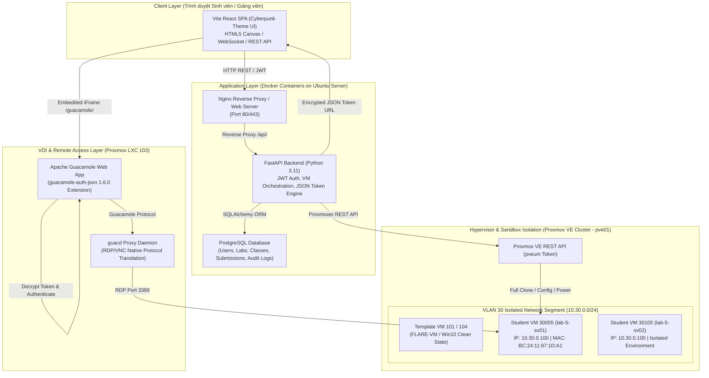
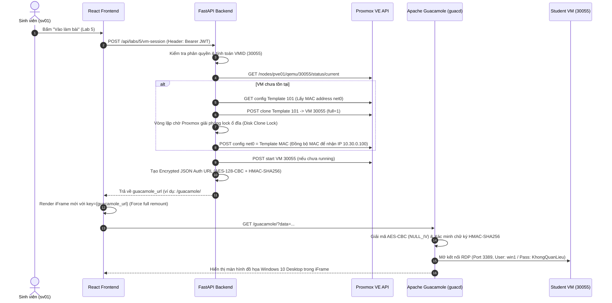
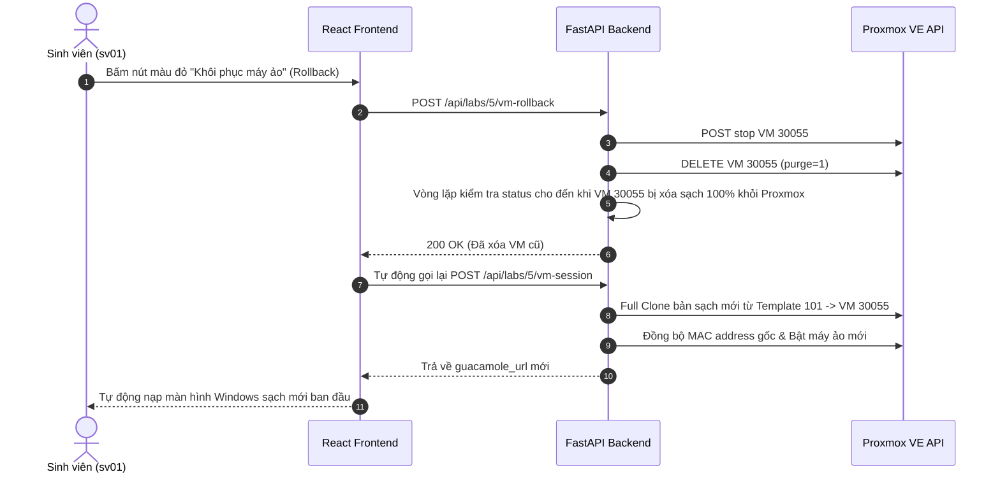
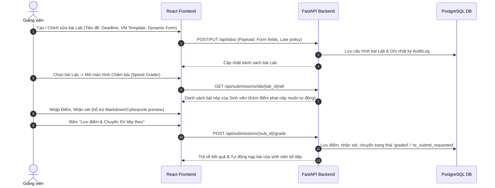

# HỆ THỐNG MALSEC - TÀI LIỆU KIẾN TRÚC, TÍNH NĂNG VÀ CƠ CHẾ VẬN HÀNH

> **Dự án**: MalSec LMS - Nền tảng Đào tạo & Thực hành Phân tích Mã độc Tự động trên Hạ tầng Máy ảo VDI (Proxmox VE + Apache Guacamole).  
> **Phiên bản**: 2.0 (Cập nhật 2026)  
> **Tác giả / Nhà phát triển**: Antigravity AI Engineering & MalSec Team  

---

## 📋 MỤC LỤC

1. [Tổng Quan Hệ Thống](#1-tổng-quan-hệ-thống)
2. [Kiến Trúc Tổng Thể (System Architecture)](#2-kiến-trúc-tổng-thể-system-architecture)
3. [Luồng Hoạt Động (System Flows)](#3-luồng-hoạt-động-system-flows)
   - [3.1. Luồng Sinh viên Khởi tạo & Làm bài Lab](#31-luồng-sinh-viên-khởi-tạo--làm-bài-lab)
   - [3.2. Luồng Khôi phục Máy ảo (VM Rollback)](#32-luồng-khôi-phục-máy-ảo-vm-rollback)
   - [3.3. Luồng Giảng viên Quản lý & Chấm điểm (Speed Grader)](#33-luồng-giảng-viên-quản-lý--chấm-điểm-speed-grader)
4. [Chi Tiết Cơ Chế Kỹ Thuật Nổi Bật](#4-chi-tiết-cơ-chế-kỹ-thuật-nổi-bật)
   - [4.1. Điều phối Máy ảo Proxmox VE tự động](#41-điều-phối-máy-ảo-proxmox-ve-tự-động)
   - [4.2. Tích hợp VDI Apache Guacamole qua Mã hóa JSON SSO Token](#42-tích-hợp-vdi-apache-guacamole-qua-mã-hóa-json-sso-token)
   - [4.3. Hạ tầng Mạng Cách ly Mã độc (VLAN 30 Sandbox)](#43-hạ-tầng-mạng-cách-ly-mã-độc-vlan-30-sandbox)
   - [4.4. Trình thiết kế Form Báo cáo Động (Dynamic Form Engine)](#44-trình-thiết-kế-form-báo-cáo-động-dynamic-form-engine)
5. [Danh Sách Tính Năng Theo Phân Quyền](#5-danh-sách-tính-năng-theo-phân-quyền)
6. [Cấu Trúc Thư Mục Dự Án & Cấu Hình Triển Khai](#6-cấu-trúc-thư-mục-dự-án--cấu-hình-triển-khai)

---

## 1. TỔNG QUAN HỆ THỐNG

**MalSec** là hệ thống quản lý học tập (LMS) kết hợp môi trường VDI thực hành phân tích mã độc chuyên sâu. Hệ thống giải quyết triệt để 3 thách thức lớn trong đào tạo An toàn thông tin:
1. **An toàn tuyệt đối**: Môi trường phân tích mã độc (FLARE-VM / Windows 10 Sandbox) được cách ly trong VLAN 30, ngăn chặn nguy cơ mã độc lây lan sang mạng nội bộ trường học hoặc máy tính cá nhân của sinh viên.
2. **Trải nghiệm Zero-Client**: Sinh viên chỉ cần trình duyệt web (Chrome/Firefox/Edge) để kết nối trực tiếp vào giao diện Desktop đồ họa của máy ảo thông qua giao thức Apache Guacamole (HTML5 VDI Proxy), không cần cài đặt phần mềm RDP/VPN hay cấu hình phức tạp.
3. **Cấp phát & Khôi phục tự động**: Mỗi sinh viên nhận một máy ảo riêng biệt được clone tự động từ Proxmox VE. Khi máy ảo bị mã độc phá hủy hoặc sinh viên muốn thực hành lại, tính năng **Rollback** sẽ tự động dừng, xóa đĩa và khôi phục máy ảo về bản sạch ban đầu chỉ trong vài giây.

---

## 2. KIẾN TRÚC TỔNG THỂ (SYSTEM ARCHITECTURE)

Hệ thống được thiết kế theo kiến trúc Microservices & VDI Orchestration gồm 4 phân vùng chính:



---

## 3. LUỒNG HOẠT ĐỘNG (SYSTEM FLOWS)

### 3.1. Luồng Sinh viên Khởi tạo & Làm bài Lab



### 3.2. Luồng Khôi phục Máy ảo (VM Rollback)



### 3.3. Luồng Giảng viên Quản lý & Chấm điểm (Speed Grader)



---

## 4. CHI TIẾT CƠ CHẾ KỸ THUẬT NỔI BẬT

### 4.1. Điều phối Máy ảo Proxmox VE tự động

- **Thuật toán cấp phát VMID**: 
  $$\text{new\_vmid} = 30000 + (\text{student\_num} \times 50) + \text{lab\_id}$$
  *Ví dụ: Sinh viên `sv01` (num=1) làm Lab `5` $\rightarrow$ VMID = `30055`.*
- **Cơ chế Xử lý EFI Disk & TPM State**:
  Do các bản sao Windows 10/11 Security trên Proxmox có đĩa EFI (`efidisk0`) và chip TPM ảo (`tpmstate0`), Proxmox không hỗ trợ *Linked Clone (`full=0`)* khi máy gốc chưa chuyển sang dạng Template chuẩn. Hệ thống tự động chuyển sang chế độ **Full Clone (`full=1`)** để đảm bảo quá trình nhân bản diễn ra 100% thành công.
- **Đồng bộ Địa chỉ MAC (MAC Address Synchronization)**:
  Khi Full Clone sang VM mới, Proxmox sinh ngẫu nhiên một địa chỉ MAC mới làm Windows 10 coi đó là "Card mạng Ethernet mới" và bỏ cấu hình IP tĩnh. Backend MalSec giải quyết bằng cách:
  1. Đọc địa chỉ MAC từ máy gốc (ví dụ: `BC:24:11:97:1D:A1`).
  2. Đợi Proxmox hoàn tất việc chép đĩa (xử lý Disk Lock).
  3. Ghi đè tham số `net0` của máy mới khớp 100% với MAC gốc.
  4. Nhờ đó, Windows 10 nhận diện đúng card mạng cũ và giữ nguyên **IP tĩnh `10.30.0.100`** trong mạng VLAN 30.

### 4.2. Tích hợp VDI Apache Guacamole qua Mã hóa JSON SSO Token

Hệ thống sử dụng Extension chính thức `guacamole-auth-json-1.6.0.jar` của Apache Guacamole để xác thực một lần (SSO) không cần truyền mật khẩu thô:

1. **Cấu trúc Payload JSON**:
   ```json
   {
     "username": "sv01",
     "expires": 1722707900000,
     "connections": {
       "Lab-VM-sv01-1722621560": {
         "protocol": "rdp",
         "parameters": {
           "hostname": "10.30.0.100",
           "port": "3389",
           "username": "win1",
           "password": "KhongQuanLieu",
           "ignore-cert": "true"
         }
       }
     }
   }
   ```
2. **Quy trình Mã hóa (Crypto Pipeline)**:
   - **Chữ ký HMAC-SHA256**: Tính chữ ký trên chuỗi JSON thô bằng Secret Key `545361e2e0cdc7a516ad17d27b1ba77c`.
   - **Đóng gói Payload**: Ghép `[Signature (32 bytes)][Raw JSON Bytes]`.
   - **Padding**: Áp dụng chuẩn **PKCS7 Padding** (Block size 128 bits = 16 bytes).
   - **Mã hóa AES-CBC**: Mã hóa dữ liệu bằng **AES-128-CBC** với `NULL_IV` (16 bytes `0x00`).
   - **Mã hóa URL**: Chuyển sang Base64 và URL Quote.
3. **Định tuyến Client Router chuẩn Guacamole**:
   - Để Guacamole nhận diện đúng loại đối tượng máy ảo (Connection), URL client bắt buộc phải chứa tiền tố **`c/`**:
     $$\text{URL} = \text{/guacamole/\#/client/c/Lab-VM-\{username\}-\{timestamp\}?data=\{quoted\_data\}}$$
   - Tham số `timestamp` tạo tên kết nối độc bản cho từng phiên làm việc, xóa bỏ hoàn toàn hiện tượng kẹt cache `localStorage` của trình duyệt.
   - Thẻ `<iframe>` phía React Frontend được gán `key={guacamoleUrl}` giúp ép trình duyệt mount lại hoàn toàn iFrame mỗi khi sinh viên yêu cầu khởi tạo phiên làm việc mới.

### 4.3. Hạ tầng Mạng Cách ly Mã độc (VLAN 30 Sandbox)

- **Mạng VLAN 30 (`10.30.0.0/24`)**: Dành riêng cho các máy ảo thực hành phân tích mã độc. Mạng này bị chặn toàn bộ lưu lượng ra Internet và không thể kết nối tới mạng nội bộ trường học hay mạng quản lý Proxmox.
- **Ủy quyền qua Daemon `guacd`**:
  - Trình duyệt sinh viên chỉ giao tiếp với cổng HTTP/WebSocket của Nginx (Port 80/443).
  - Web Server chuyển tiếp dữ liệu tới Guacamole Tomcat.
  - Guacamole Tomcat gửi lệnh tới `guacd` proxy daemon.
  - `guacd` mở kết nối RDP nội bộ (Port 3389) tới IP `10.30.0.100` trong VLAN 30 và truyền luồng hình ảnh đồ họa dạng H.264/PNG về trình duyệt sinh viên.

### 4.4. Trình thiết kế Form Báo cáo Động (Dynamic Form Engine)

- **Dành cho Giảng viên**:
  - Tự do thiết kế câu hỏi báo cáo với nhiều loại trường: `Text` (Mã băm MD5/SHA256), `Textarea` (Mã Assembly/Tự luận), `Select` (Chọn 1 phương án), `Checkbox` (Chọn nhiều hành vi), `File` (Ảnh chụp màn hình Wireshark/OllyDbg, pcap, zip).
- **Tính điểm Phạt Nộp muộn tự động**:
  - Hệ thống tự động tính toán số giờ nộp muộn dựa trên `deadline` và thời điểm bấm nộp bài.
  - Áp dụng công thức:
    $$\text{Penalty \%} = \min\left(\text{hours\_late} \times \text{penalty\_per\_hour}, \text{max\_penalty}\right)$$
  - Điểm số và mức phạt được tự động hiển thị trên giao diện Speed Grader cho Giảng viên tham chiếu khi chấm.

---

## 5. DANH SÁCH TÍNH NĂNG THEO PHÂN QUYỀN

### 🎓 5.1. Phân quyền Sinh viên (Student Portal)
- **Xem danh sách Bài Lab**: Hiển thị trạng thái bài làm (Chưa làm, Đang nháp, Đã nộp, Đã chấm, Yêu cầu nộp lại), Thời hạn deadline, Điểm số & Nhận xét của giảng viên.
- **Môi trường Máy ảo VDI**: Bấm "Vào làm bài" để mở máy ảo Windows Sandbox đồ họa ngay trên trình duyệt.
- **Khôi phục Máy ảo (Rollback)**: Nút màu đỏ cho phép tự động xóa máy cũ và reset lại máy ảo sạch ban đầu.
- **Mở cửa sổ mới**: Nút hỗ trợ mở giao diện máy ảo VDI ra một Tab riêng full màn hình.
- **Lưu nháp & Nộp bài**: Tự động lưu bản nháp báo cáo lên Server; Hỗ trợ xem preview Markdown và tải lên các tệp bằng chứng.

### 👨‍🏫 5.2. Phân quyền Giảng viên (Instructor Portal)
- **Thiết kế Bài Lab Động**: Tạo mới bài thực hành, mô tả bài lab, chọn Lớp học phần, cấu hình thời hạn nộp bài, bật/tắt kết nối máy ảo và chọn Proxmox VM Template.
- **Sửa & Xóa Bài Lab**: Cho phép cập nhật lại nội dung/cấu hình bài lab hoặc xóa bài lab khỏi hệ thống (Kèm xác nhận an toàn).
- **Speed Grader Chấm bài**: Giao diện chấm bài tập trung, hiển thị bài nộp của sinh viên, xem ảnh/file đính kèm, chấm điểm, nhập nhận xét và yêu cầu sinh viên làm lại (Resubmit).
- **Xuất Báo cáo CSV & Tải ZIP**: Xuất bảng điểm lớp học ra file CSV/Excel hoặc tải gói ZIP chứa toàn bộ bài nộp của sinh viên.
- **Gia hạn riêng (Individual Extensions)**: Cho phép gia hạn deadline riêng cho từng sinh viên có lý do đặc biệt.
- **Quản lý Lớp & Sinh viên**: Tìm kiếm sinh viên theo tên/MSSV, thêm/bớt sinh viên vào lớp học phần, tạo tài khoản sinh viên mới hoặc cập nhật mật khẩu.

### 🛡️ 5.3. Phân quyền Quản trị viên (Admin Portal)
- **Quản lý Người dùng**: Xem toàn bộ danh sách tài khoản, tạo mới, chỉnh sửa vai trò (`student`, `lecturer`, `admin`), khóa/mở khóa tài khoản.
- **Quản lý Lớp học phần**: Tạo mới lớp học phần và gán giảng viên phụ trách.
- **Nhật ký Hệ thống (Audit Logs)**: Theo dõi toàn bộ lịch sử hoạt động (Tạo lab, chấm điểm, nộp bài, đăng nhập) cùng địa chỉ IP.

---

## 6. CẤU TRÚC THƯ MỤC DỰ ÁN & CẤU HÌNH TRIỂN KHAI

### 📂 Cấu trúc mã nguồn

```text
MalSec/
├── backend/                    # FastAPI Backend Service (Python 3.11)
│   ├── app/
│   │   ├── main.py             # FastAPI App Entrypoint & Middleware
│   │   ├── config.py           # Quản lý Biến môi trường (PVE, Guacamole, DB)
│   │   ├── database.py         # SQLAlchemy Database Engine
│   │   ├── models.py           # SQLAlchemy Database Models
│   │   ├── schemas.py          # Pydantic Schemas (Request/Response Validation)
│   │   ├── routers/            # API Endpoints (auth, labs, classes, users, submissions)
│   │   └── services/
│   │       └── vm_service.py   # Proxmox VE API Orchestration & Guacamole Crypto Engine
│   ├── Dockerfile
│   └── requirements.txt
├── frontend/                   # React Single Page Application (Vite)
│   ├── src/
│   │   ├── App.jsx             # Main Router & Authentication Guard
│   │   ├── main.jsx            # React DOM Mount Point
│   │   ├── index.css           # Design System & Cyberpunk Theme Utilities
│   │   └── pages/
│   │       ├── StudentDashboard.jsx     # Giao diện Sinh viên & Guacamole VDI iFrame
│   │       ├── InstructorDashboard.jsx  # Giao diện Giảng viên & Speed Grader
│   │       ├── AdminDashboard.jsx       # Giao diện Quản trị viên
│   │       └── Login.jsx                # Giao diện Đăng nhập
│   ├── nginx.conf              # Nginx Configuration trong Container
│   ├── Dockerfile
│   └── package.json
├── docker-compose.yml          # Container Orchestration (Backend, Frontend, PostgreSQL)
└── .env                        # File biến môi trường bảo mật
```

### ⚙️ Các biến môi trường quan trọng (`.env`)

```ini
# Cấu hình Cơ sở dữ liệu PostgreSQL
DB_USER=postgres
DB_PASSWORD=malsec_db_pass_2026
DB_NAME=malsec_lms

# Cấu hình Bảo mật JWT Token
JWT_SECRET=super_secret_jwt_key_for_malsec_lms_2026_!!
JWT_ALGORITHM=HS256
ACCESS_TOKEN_EXPIRE_MINUTES=480

# Cấu hình Proxmox VE API (Real Token)
PVE_API_HOST=10.0.80.10
PVE_API_USER=root@pam
PVE_TOKEN_NAME=malsec-token
PVE_TOKEN_VALUE=a363ce9d-3a08-451e-b5c5-45122b94c563

# Cấu hình Apache Guacamole Encrypted JSON
GUAC_BASE_URL=/guacamole/
GUAC_HMAC_SECRET=MySuperSecretKeyForGuacHMAC2026!
GUAC_JSON_SECRET=545361e2e0cdc7a516ad17d27b1ba77c
```

---

## 7. TỔNG KẾT

Hệ thống **MalSec** đã hoàn thiện một giải pháp đào tạo an toàn thông tin toàn diện, kết hợp chặt chẽ giữa **Công nghệ Web hiện đại**, **Tự động hóa Hạ tầng Máy ảo (Proxmox VE API)** và **Giải pháp VDI mã hóa bảo mật cao (Apache Guacamole JSON SSO)**. Hệ thống sẵn sàng phục vụ quy mô giảng dạy thực tế với khả năng vận hành ổn định, tự động khôi phục và bảo mật cách ly mã độc tuyệt đối.
