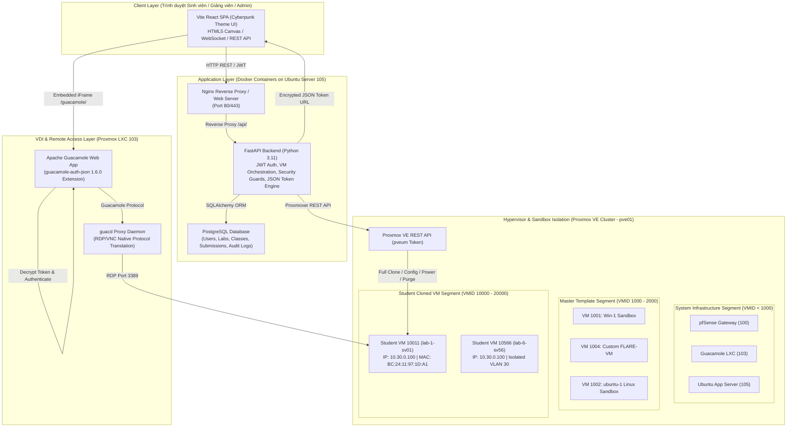
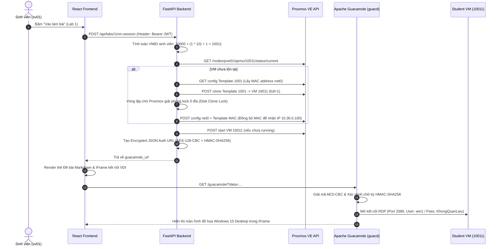
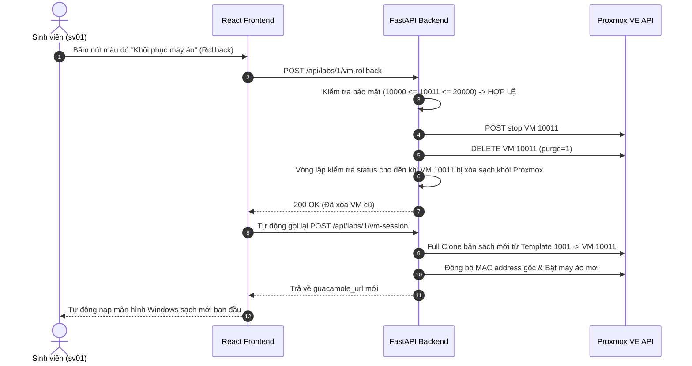
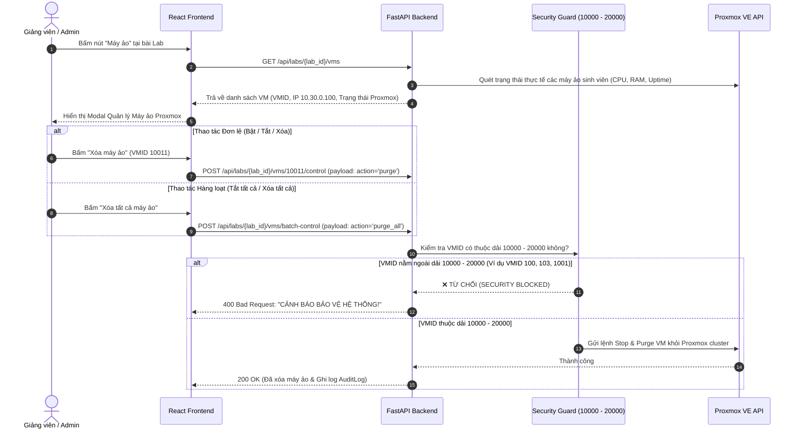

# HỆ THỐNG MALSEC - TÀI LIỆU KIẾN TRÚC, TÍNH NĂNG VÀ CƠ CHẾ VẬN HÀNH

> **Dự án**: MalSec LMS - Nền tảng Đào tạo & Thực hành Phân tích Mã độc Tự động trên Hạ tầng Máy ảo VDI (Proxmox VE + Apache Guacamole).

---

## 📋 MỤC LỤC

1. [Tổng Quan Hệ Thống](#1-tổng-quan-hệ-thống)
2. [Kiến Trúc Tổng Thể (System Architecture)](#2-kiến-trúc-tổng-thể-system-architecture)
3. [Luồng Hoạt Động (System Flows)](#3-luồng-hoạt-động-system-flows)
   - [3.1. Luồng Sinh viên Khởi tạo & Làm bài Lab](#31-luồng-sinh-viên-khởi-tạo--làm-bài-lab)
   - [3.2. Luồng Khôi phục Máy ảo (VM Rollback)](#32-luồng-khôi-phục-máy-ảo-vm-rollback)
   - [3.3. Luồng Giảng viên & Admin Quản lý Máy ảo (VM Management)](#33-luồng-giảng-viên--admin-quản-lý-máy-ảo-vm-management)
   - [3.4. Luồng Giảng viên Tạo bài & Chấm điểm (Speed Grader)](#34-luồng-giảng-viên-tạo-bài--chấm-điểm-speed-grader)
4. [Chi Tiết Cơ Chế Kỹ Thuật Nổi Bật](#4-chi-tiết-cơ-chế-kỹ-thuật-nổi-bật)
   - [4.1. Điều phối & Quy hoạch Dải VMID Proxmox VE](#41-điều-phối--quy-hoạch-dải-vmid-proxmox-ve)
   - [4.2. Chốt Khóa Bảo Vệ An Toàn Hệ Thống (VMID Security Boundary)](#42-chốt-khóa-bảo-vệ-an-toàn-hệ-thống-vmid-security-boundary)
   - [4.3. Tích hợp VDI Apache Guacamole qua Mã hóa JSON SSO Token](#43-tích-hợp-vdi-apache-guacamole-qua-mã-hóa-json-sso-token)
   - [4.4. Hạ tầng Mạng Cách ly Mã độc (VLAN 30 Sandbox)](#44-hạ-tầng-mạng-cách-ly-mã-độc-vlan-30-sandbox)
   - [4.5. Trình hiển thị Đề bài Markdown & Form Báo cáo Động](#45-trình-hiển-thị-đề-bài-markdown--form-báo-cáo-động)
5. [Danh Sách Tính Năng Chi Tiết Theo Phân Quyền](#5-danh-sách-tính-năng-chi-tiết-theo-phân-quyền)
6. [Cấu Trúc Thư Mục Dự Án & Cấu Hình Triển Khai](#6-cấu-trúc-thư-mục-dự-án--cấu-hình-triển-khai)

---

## 1. TỔNG QUAN HỆ THỐNG

**MalSec** là hệ thống quản lý học tập (LMS) kết hợp môi trường VDI thực hành phân tích mã độc chuyên sâu. Hệ thống giải quyết triệt để các thách thức lớn trong đào tạo An toàn thông tin:
1. **An toàn tuyệt đối**: Môi trường phân tích mã độc (FLARE-VM / Windows 10 Sandbox / Linux Sandbox) được cách ly hoàn toàn trong VLAN 30, ngăn chặn nguy cơ mã độc lây lan sang mạng nội bộ trường học hoặc máy tính cá nhân của sinh viên.
2. **Trải nghiệm Zero-Client**: Sinh viên chỉ cần trình duyệt web (Chrome/Firefox/Edge) để kết nối trực tiếp vào giao diện Desktop đồ họa của máy ảo thông qua giao thức Apache Guacamole (HTML5 VDI Proxy), không cần cài đặt phần mềm RDP/VPN hay cấu hình phức tạp.
3. **Cấp phát, Khôi phục & Quản lý Máy ảo Tự động**: Mỗi sinh viên nhận một máy ảo riêng biệt được clone tự động từ Proxmox VE. Giảng viên và Admin có bảng điều khiển tập trung để theo dõi tài nguyên thực tế (CPU/RAM), bật/tắt từ xa, hoặc **xóa sạch máy ảo (Purge VM)** đơn lẻ hoặc hàng loạt chỉ với 1 cú nhấp chuột.

---

## 2. KIẾN TRÚC TỔNG THỂ (SYSTEM ARCHITECTURE)

Hệ thống được thiết kế theo kiến trúc Microservices & VDI Orchestration gồm 4 phân vùng chính:



---

## 3. LUỒNG HOẠT ĐỘNG (SYSTEM FLOWS)

### 3.1. Luồng Sinh viên Khởi tạo & Làm bài Lab



### 3.2. Luồng Khôi phục Máy ảo (VM Rollback)



### 3.3. Luồng Giảng viên & Admin Quản lý Máy ảo (VM Management)



---

## 4. CHI TIẾT CƠ CHẾ KỸ THUẬT NỔI BẬT

### 4.1. Điều phối & Quy hoạch Dải VMID Proxmox VE

Hệ thống thiết lập nguyên tắc phân bổ VMID nghiêm ngặt trên cụm Proxmox cluster:

- **⚙️ Dải Hạ tầng Hệ thống (`VMID < 1000`)**:
  - Dành riêng cho các VM/LXC hạ tầng (`pfSense 100`, `Guacamole 103`, `App Server 105`...). Không cho phép tạo/xóa từ giao diện ứng dụng.
- **🖥️ Dải Máy ảo Mẫu (`1000 <= VMID <= 2000`)**:
  - Dành riêng cho các **Master Template / Base VMs** làm mẫu nhân bản bài thực hành (ví dụ: `1001 - Win-1`, `1004 - FLARE-VM`, `1002 - ubuntu-1`).
  - Dropdown khi Giảng viên tạo/sửa bài Lab chỉ quét và hiển thị các máy thuộc dải này.
- **⚡ Dải Máy ảo Sinh viên (`10000 <= VMID <= 20000`)**:
  - Được sinh tự động theo công thức:
    $$\text{new\_vmid} = 10000 + (\text{student\_num} \times 10) + \text{lab\_id}$$
  - *Ví dụ: Sinh viên `sv01` (num=1) làm Lab `1` $\rightarrow$ VMID = `10011`.*
  - *Sinh viên `sv56` (num=56) làm Lab `6` $\rightarrow$ VMID = `10566`.*

### 4.2. Chốt Khóa Bảo Vệ An Toàn Hệ Thống (VMID Security Boundary)

Để ngăn chặn tuyệt đối rủi ro xóa nhầm máy ảo hệ thống hoặc máy ảo của dự án khác trên Proxmox, Backend MalSec tích hợp **Chốt bảo vệ an toàn 2 lớp**:
1. **Lớp Router API (`labs.py`)**: Kiểm tra `10000 <= vmid <= 20000` trước khi tiếp nhận yêu cầu điều khiển/xóa.
2. **Lớp Core Service (`vm_service.py`)**: Kiểm tra trực tiếp tại hàm `control_student_vm` và `rollback_student_vm`. Nếu VMID $< 10000$ hoặc $> 20000$, hệ thống lập tức hủy lệnh và ghi nhận log cảnh báo an ninh `[SECURITY BLOCKED]`.

### 4.3. Tích hợp VDI Apache Guacamole qua Mã hóa JSON SSO Token

Sử dụng Extension `guacamole-auth-json-1.6.0.jar` xác thực một lần (SSO):

1. **Quy trình Mã hóa (Crypto Pipeline)**:
   - **Chữ ký HMAC-SHA256**: Tính chữ ký trên chuỗi JSON thô bằng Secret Key `545361e2e0cdc7a516ad17d27b1ba77c`.
   - **Padding**: Áp dụng chuẩn **PKCS7 Padding** (Block size 128 bits = 16 bytes).
   - **Mã hóa AES-CBC**: Mã hóa dữ liệu bằng **AES-128-CBC** với `NULL_IV` (16 bytes `0x00`).
   - **Mã hóa URL**: Chuyển sang Base64 và URL Quote.
2. **Định tuyến Client Router chuẩn Guacamole**:
   - URL client bắt buộc chứa tiền tố **`c/`**:
     $$\text{URL} = \text{/guacamole/\#/client/c/Lab-VM-\{username\}-\{timestamp\}?data=\{quoted\_data\}}$$
   - Thẻ `<iframe>` phía React Frontend được gán `key={guacamoleUrl}` giúp ép trình duyệt mount lại hoàn toàn iFrame mỗi khi sinh viên yêu cầu khởi tạo phiên làm việc mới.

### 4.4. Hạ tầng Mạng Cách ly Mã độc (VLAN 30 Sandbox)

- **Mạng VLAN 30 (`10.30.0.0/24`)**: Dành riêng cho các máy ảo thực hành phân tích mã độc. Mạng này bị chặn toàn bộ lưu lượng ra Internet và không thể kết nối tới mạng nội bộ trường học hay mạng quản lý Proxmox.
- **Ủy quyền qua Daemon `guacd`**:
  - Trình duyệt sinh viên chỉ giao tiếp với cổng HTTP/WebSocket của Nginx (Port 80/443).
  - `guacd` daemon mở kết nối RDP nội bộ (Port 3389) tới IP `10.30.0.100` trong VLAN 30 và truyền luồng hình ảnh đồ họa dạng H.264/PNG về trình duyệt sinh viên.

### 4.5. Trình hiển thị Đề bài Markdown & Form Báo cáo Động

- **Thẻ Đề bài & Hướng dẫn Chi tiết (Lab Description Viewer)**:
  - Hiển thị mô tả đề bài ngay tại màn hình Workbench phía trên phiếu báo cáo.
  - Hỗ trợ bộ parse Cyberpunk Markdown render đầy đủ tiêu đề `##`, danh sách, bảng, đoạn mã mã độc ```` ````, cảnh báo `[!]`...
- **Trình thiết kế Form Báo cáo Động (Dynamic Form Engine)**:
  - Giảng viên tự do thiết kế các trường: `Text` (Mã băm MD5/SHA256), `Textarea` (Mã Assembly/Tự luận), `Select` (Chọn 1 phương án), `Checkbox` (Chọn nhiều hành vi), `File` (Ảnh chụp màn hình Wireshark/OllyDbg, pcap, zip).
- **Tính điểm Phạt Nộp muộn tự động**:
  - Công thức phạt:
    $$\text{Penalty \%} = \min\left(\text{hours\_late} \times \text{penalty\_per\_hour}, \text{max\_penalty}\right)$$

---

## 5. DANH SÁCH TÍNH NĂNG CHI TIẾT THEO PHÂN QUYỀN

### 🎓 5.1. Phân quyền Sinh viên (Student Portal)
- **Dashboard Bài học & Mô tả**: Hiển thị danh sách bài Lab kèm đoạn mô tả tóm tắt đề bài, thời hạn nộp bài, điểm số & nhận xét của giảng viên.
- **Workbench Thực hành VDI**: Giao diện chia đôi màn hình: Phía trái/trên là máy ảo Windows/Linux đồ họa qua Guacamole; Phía phải là **Thẻ Đề bài Markdown chi tiết** và **Form Báo cáo Động**.
- **Khôi phục Máy ảo (Rollback)**: Nút màu đỏ cho phép tự động xóa máy cũ và reset lại máy ảo sạch ban đầu.
- **Mở cửa sổ VDI riêng**: Hỗ trợ mở giao diện máy ảo ra một Tab riêng full màn hình.
- **Lưu nháp & Nộp bài**: Tự động lưu bản nháp báo cáo lên Server; Hỗ trợ xem preview Markdown và tải lên các tệp bằng chứng.

### 👨‍🏫 5.2. Phân quyền Giảng viên (Instructor Portal)
- **Thiết kế Bài Lab Động**: Tạo mới/chỉnh sửa bài thực hành, nhập tiêu đề, mô tả đề bài dạng Markdown, chọn Lớp học phần, cấu hình deadline, bật/tắt kết nối máy ảo và chọn Proxmox VM Template từ dải ID `1000 - 2000`.
- **Sửa & Xóa Bài Lab**: Cho phép cập nhật nội dung bài lab hoặc xóa bài lab khỏi hệ thống (Kèm xác nhận an toàn).
- **🖥️ Quản lý Máy ảo Sinh viên (VM Manager)**:
  - Giám sát trạng thái thực tế (`🟢 RUNNING`, `🔴 STOPPED`, `⚪ CHƯA TẠO`), IP tĩnh `10.30.0.100`, % CPU, RAM tiêu thụ của từng sinh viên.
  - **Nút điều khiển đơn lẻ**: Bật máy, Tắt máy, Xóa máy ảo (Purge VM).
  - **Nút điều khiển hàng loạt**: 🛑 **Tắt tất cả máy ảo**, 🗑️ **Xóa tất cả máy ảo** thuộc bài Lab đó khỏi Proxmox cluster.
- **Speed Grader Chấm bài**: Giao diện chấm bài tập trung, hiển thị bài nộp của sinh viên, xem ảnh/file đính kèm, chấm điểm, nhập nhận xét và yêu cầu sinh viên làm lại (Resubmit).
- **Xuất Báo cáo CSV & Tải ZIP**: Xuất bảng điểm lớp học ra file CSV/Excel hoặc tải gói ZIP chứa toàn bộ bài nộp của sinh viên.
- **Quản lý Lớp & Sinh viên**: Tìm kiếm sinh viên theo tên/MSSV, thêm/bớt sinh viên vào lớp học phần, tạo tài khoản sinh viên mới hoặc cập nhật mật khẩu.

### 🛡️ 5.3. Phân quyền Quản trị viên (Admin Portal)
- **Quản lý Người dùng**: Xem toàn bộ danh sách tài khoản, tạo mới, chỉnh sửa vai trò (`student`, `lecturer`, `admin`), khóa/mở khóa tài khoản. Import hàng loạt tài khoản sinh viên từ file CSV.
- **Quản lý Lớp học phần (Sửa & Xóa Lớp)**:
  - Tạo mới lớp học phần, **Chỉnh sửa thông tin lớp** và **Xóa lớp học phần**.
  - Gán Giảng viên & Sinh viên vào lớp bằng **Tên đăng nhập (Username/MSSV)** với Menu gợi ý tìm kiếm Dropdown tự động đóng/mở thông minh.
- **🖥️ Quản lý Máy ảo Toàn hệ thống (Admin VM Control)**:
  - Xem danh sách toàn bộ bài Lab trên hệ thống, bật/tắt hoặc **xóa sạch máy ảo sinh viên** đơn lẻ hoặc hàng loạt của bất kỳ bài Lab nào.
- **Nhật ký Hệ thống (Audit Logs)**: Theo dõi toàn bộ lịch sử hoạt động (Tạo lab, chấm điểm, nộp bài, điều khiển máy ảo, đăng nhập) cùng địa chỉ IP.

---

## 6. CẤU TRÚC THƯ MỤC DỰ ÁN & CẤU HÌNH TRIỂN KHAI

### 📂 Cấu trúc mã nguồn

```text
MalSec/
├── backend/                    # FastAPI Backend Service (Python 3.11)
│   ├── app/
│   │   ├── main.py             # FastAPI App Entrypoint & Middleware
│   │   ├── config.py           # Quản lý Biến môi trường (PVE, Guacamole, DB, VMID Ranges)
│   │   ├── database.py         # SQLAlchemy Database Engine
│   │   ├── models.py           # SQLAlchemy Database Models
│   │   ├── schemas.py          # Pydantic Schemas (Request/Response Validation)
│   │   ├── routers/            # API Endpoints (auth, labs, classes, users, submissions)
│   │   └── services/
│   │       └── vm_service.py   # Proxmox VE API Orchestration & Security Guards
│   ├── Dockerfile
│   └── requirements.txt
├── frontend/                   # React Single Page Application (Vite)
│   ├── src/
│   │   ├── App.jsx             # Main Router & Authentication Guard
│   │   ├── main.jsx            # React DOM Mount Point
│   │   ├── index.css           # Design System & Cyberpunk Theme Utilities
│   │   └── pages/
│   │       ├── StudentDashboard.jsx     # Giao diện Sinh viên, Đề bài Markdown & VDI iFrame
│   │       ├── InstructorDashboard.jsx  # Giao diện Giảng viên, Speed Grader & VM Manager
│   │       ├── AdminDashboard.jsx       # Giao diện Admin, Lớp học phần & Admin VM Control
│   │       └── Login.jsx                # Giao diện Đăng nhập
│   ├── nginx.conf              # Nginx Configuration trong Container
│   ├── Dockerfile
│   └── package.json
├── docker-compose.yml          # Container Orchestration (Backend, Frontend, PostgreSQL)
└── .env                        # File biến môi trường bảo mật
```

---

## 7. TỔNG KẾT

Hệ thống **MalSec** là một giải pháp đào tạo an toàn thông tin toàn diện, kết hợp chặt chẽ giữa **Công nghệ Web hiện đại**, **Tự động hóa & Quy hoạch Hạ tầng Máy ảo (Proxmox VE API)** và **Giải pháp VDI mã hóa bảo mật cao (Apache Guacamole JSON SSO)**. Hệ thống sẵn sàng phục vụ quy mô giảng dạy thực tế với khả năng vận hành ổn định, quản lý máy ảo linh hoạt, tự động khôi phục và bảo mật cách ly mã độc tuyệt đối.
