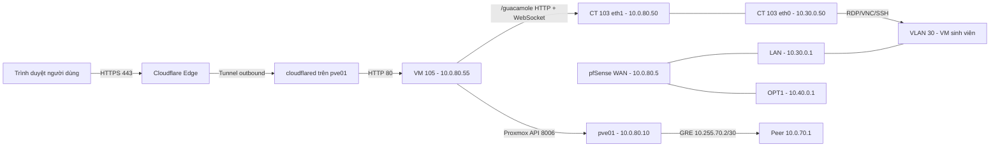
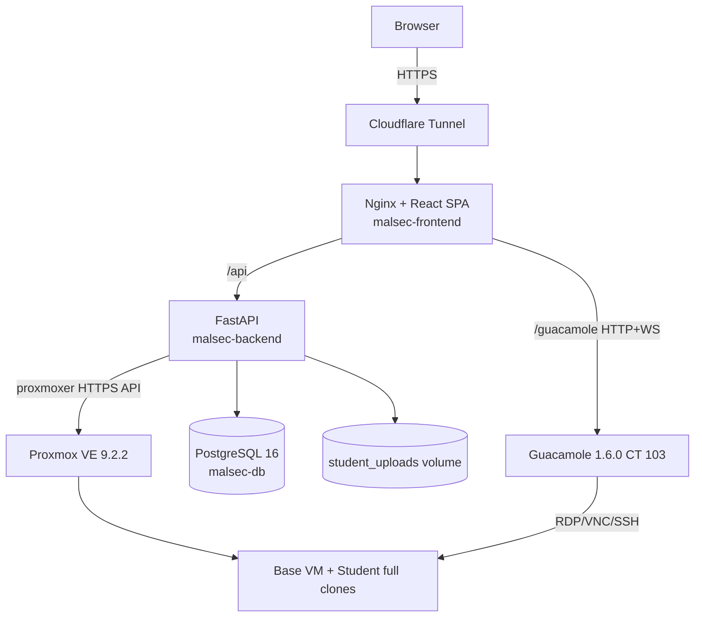

# HỒ SƠ HIỆN TRẠNG, KIẾN TRÚC, TRIỂN KHAI VÀ HƯỚNG DẪN VẬN HÀNH MALSEC

**Hệ thống:** Malware Lab trên Proxmox VE và nền tảng MalSec LMS  
**Phiên bản tài liệu:** 1.1 — hiệu đính sau rà soát chéo lần hai  
**Ngày chốt hiện trạng:** 05/08/2026, múi giờ Asia/Ho_Chi_Minh (UTC+7)  
**Phạm vi:** node `pve01`, pfSense, toàn bộ VM/LXC, mạng, storage, Apache Guacamole, Cloudflare Tunnel, VM triển khai `ubuntu-105`, mã nguồn và dữ liệu vận hành MalSec  
**Nguồn nền:** [Ho_so_kien_truc_Malware_Lab_v3.docx](./Ho_so_kien_truc_Malware_Lab_v3.docx), mã nguồn tại workspace và kiểm tra trực tiếp qua SSH/API/QEMU Guest Agent  
**Mức độ bí mật:** Nội bộ. Tài liệu cố ý không chứa mật khẩu, API token, khóa JWT, khóa Guacamole, tunnel token, serial phần cứng hoặc UUID nhạy cảm.

> **Cảnh báo an toàn:** Đây là hồ sơ “as-is” của môi trường lab tại thời điểm kiểm tra, không phải chứng nhận hệ thống đã đạt mức cô lập malware production. Các mục ghi “đã quan sát” là kết quả kiểm tra trực tiếp. Các mục ghi “suy luận” được rút ra từ topology/cấu hình. Các mục ghi “khuyến nghị” chưa được áp dụng nếu không nêu rõ.

### Lịch sử hiệu đính

| Phiên bản | Ngày | Nội dung |
|---|---|---|
| 1.0 | 05/08/2026 | Hồ sơ as-is đầu tiên sau kiểm kê source và live system. |
| 1.1 | 05/08/2026 | Rà soát chéo lần hai: sửa luồng Guacamole/VM và lệnh Sysprep; làm rõ quyền API, timezone, ZIP password, cleanup; bổ sung toàn bộ ISO/template, port CT 103, giới hạn audit pfSense và risk register. |

---

## Mục lục

- [1. Tóm tắt điều hành](#1-tóm-tắt-điều-hành)
- **Phần I — Hồ sơ hiện trạng toàn bộ hệ thống Proxmox**
  - [2. Phạm vi và phương pháp kiểm kê](#2-phạm-vi-và-phương-pháp-kiểm-kê)
  - [3. Node Proxmox pve01](#3-node-proxmox-pve01)
  - [4. Kiến trúc mạng live](#4-kiến-trúc-mạng-live)
  - [5. pfSense VM 100](#5-pfsense-vm-100)
  - [6. Apache Guacamole — LXC 103](#6-apache-guacamole--lxc-103)
  - [7. Cloudflare Tunnel và điểm vào công khai](#7-cloudflare-tunnel-và-điểm-vào-công-khai)
  - [8. Danh mục toàn bộ VM và LXC](#8-danh-mục-toàn-bộ-vm-và-lxc)
  - [9. Biên cô lập và các luồng được phép](#9-biên-cô-lập-và-các-luồng-được-phép)
  - [10. Quản trị Proxmox, API và quyền](#10-quản-trị-proxmox-api-và-quyền)
  - [11. Khởi động, dừng và kiểm tra sức khỏe hạ tầng](#11-khởi-động-dừng-và-kiểm-tra-sức-khỏe-hạ-tầng)
  - [12. Backup và khôi phục hạ tầng](#12-backup-và-khôi-phục-hạ-tầng)
- **Phần II — Kiến trúc, cơ chế và triển khai ứng dụng MalSec**
  - [13. Mục tiêu và ranh giới ứng dụng](#13-mục-tiêu-và-ranh-giới-ứng-dụng)
  - [14. Kiến trúc triển khai live](#14-kiến-trúc-triển-khai-live)
  - [15. Cấu trúc mã nguồn](#15-cấu-trúc-mã-nguồn)
  - [16. Mô hình dữ liệu](#16-mô-hình-dữ-liệu)
  - [17. Xác thực, phiên và RBAC](#17-xác-thực-phiên-và-rbac)
  - [18. Luồng cấp phát VM](#18-luồng-cấp-phát-vm)
  - [19. Cơ chế Guacamole Encrypted JSON](#19-cơ-chế-guacamole-encrypted-json)
  - [20. Luồng LMS, bài nộp và chấm điểm](#20-luồng-lms-bài-nộp-và-chấm-điểm)
  - [21. Xử lý file — chức năng thật và giới hạn](#21-xử-lý-file--chức-năng-thật-và-giới-hạn)
  - [22. Nginx và routing](#22-nginx-và-routing)
  - [23. Cấu hình runtime](#23-cấu-hình-runtime)
  - [24. API endpoint theo role](#24-api-endpoint-theo-role)
  - [25. Hướng dẫn triển khai MalSec từ đầu](#25-hướng-dẫn-triển-khai-malsec-từ-đầu)
  - [26. Cập nhật, rollback và reset ứng dụng](#26-cập-nhật-rollback-và-reset-ứng-dụng)
  - [27. Logging, monitoring và vận hành app](#27-logging-monitoring-và-vận-hành-app)
- **Phần III — Hướng dẫn sử dụng theo vai trò**
  - [28. Quy tắc chung cho mọi người dùng](#28-quy-tắc-chung-cho-mọi-người-dùng)
  - [29. Hướng dẫn Quản trị viên](#29-hướng-dẫn-quản-trị-viên)
  - [30. Hướng dẫn Giảng viên](#30-hướng-dẫn-giảng-viên)
  - [31. Hướng dẫn Sinh viên](#31-hướng-dẫn-sinh-viên)
- **Phần IV — Tạo và quản lý VM base/template**
  - [32. Nguyên tắc chung](#32-nguyên-tắc-chung)
  - [33. Windows 10/11 hoặc FLARE-VM qua RDP](#33-windows-1011-hoặc-flare-vm-qua-rdp)
  - [34. Ubuntu/Debian Desktop qua XRDP](#34-ubuntudebian-desktop-qua-xrdp)
  - [35. Linux Server qua SSH](#35-linux-server-qua-ssh)
  - [36. Linux Desktop qua VNC](#36-linux-desktop-qua-vnc)
  - [37. REMnux trên Proxmox](#37-remnux-trên-proxmox)
  - [38. Bảo trì base VM](#38-bảo-trì-base-vm)
- **Phần V — Troubleshooting và runbook sự cố**
  - [39. Không mở được VM hoặc iframe reconnect liên tục](#39-không-mở-được-vm-hoặc-iframe-reconnect-liên-tục)
  - [40. Hai sinh viên thấy cùng file](#40-hai-sinh-viên-thấy-cùng-file)
  - [41. Rollback báo lỗi](#41-rollback-báo-lỗi)
  - [42. Chỉ nhận chuột, không nhận bàn phím](#42-chỉ-nhận-chuột-không-nhận-bàn-phím)
  - [43. Hình nền đen qua Guacamole](#43-hình-nền-đen-qua-guacamole)
  - [44. VM không nhận IP hoặc trùng IP](#44-vm-không-nhận-ip-hoặc-trùng-ip)
  - [45. Sandbox không có DNS/Internet](#45-sandbox-không-có-dnsinternet)
  - [46. App/DB lỗi](#46-appdb-lỗi)
- **Phần VI — Đánh giá rủi ro và lộ trình hoàn thiện**
  - [47. Risk register hiện tại](#47-risk-register-hiện-tại)
  - [48. Lộ trình ưu tiên](#48-lộ-trình-ưu-tiên)
  - [49. Tiêu chí nghiệm thu an toàn](#49-tiêu-chí-nghiệm-thu-an-toàn)
- **Phụ lục**
  - [A. Ma trận cấu hình live cô đọng](#a-ma-trận-cấu-hình-live-cô-đọng)
  - [B. Port matrix](#b-port-matrix)
  - [C. Kiểm tra hàng ngày/tuần/tháng](#c-kiểm-tra-hàng-ngàytuầntháng)
  - [D. Mẫu kiểm thử một lab mới](#d-mẫu-kiểm-thử-một-lab-mới)
  - [E. Đối chiếu hồ sơ Word v3 với hiện trạng mới](#e-đối-chiếu-hồ-sơ-word-v3-với-hiện-trạng-mới)
  - [F. Tài liệu tham chiếu chính thức](#f-tài-liệu-tham-chiếu-chính-thức)
  - [G. Thông tin không được ghi vào hồ sơ](#g-thông-tin-không-được-ghi-vào-hồ-sơ)
  - [Kết luận](#kết-luận)

---

## 1. Tóm tắt điều hành

MalSec là một LMS phục vụ lớp thực hành phân tích mã độc. Người dùng làm việc trên trình duyệt; backend cấp phát một VM riêng theo cặp `tài khoản + bài lab` trên Proxmox, lấy IP thật qua QEMU Guest Agent, sau đó tạo phiên Apache Guacamole bằng Encrypted JSON để nhúng RDP/VNC/SSH vào giao diện bài làm. Báo cáo được lưu trên PostgreSQL và volume upload; giảng viên quản lý lớp, bài lab, VM và chấm điểm; quản trị viên quản lý tài khoản, lớp, audit log và VM.

Hệ thống live hiện hoạt động end-to-end với hai nguồn VM chính:

- VM `1001` — Windows 10, dùng RDP.
- VM `1003` — Ubuntu Desktop 24.04, dùng XRDP.

Ba clone sinh viên đang tồn tại và có MAC, IP, disk riêng. Việc cấp phát hiện dùng **full clone**, MAC ngẫu nhiên riêng và IP DHCP được đọc qua QEMU Guest Agent; lỗi nhiều sinh viên cùng trỏ vào một VM/MAC/IP của phiên bản cũ đã được xử lý trong mã đang deploy.

Tuy nhiên, kiểm tra toàn bộ Proxmox phát hiện một số khoảng trống phải xử lý trước khi dùng malware thật ở mức rủi ro cao:

1. Token Proxmox của backend thuộc `root@pam`, `privsep=0`, thừa hưởng toàn quyền root.
2. PVE firewall đang ở trạng thái disabled; rule cấp cluster/node/VM trống. Các cờ `firewall=1` trên NIC chưa tạo thành biên bảo vệ khi firewall tổng thể chưa bật.
3. Tất cả VM sinh viên và NIC trong của Guacamole cùng VLAN 30/subnet `/24`. Lưu lượng ngang cùng subnet đi ở lớp 2 và không qua pfSense. Windows clone đang lắng nghe cả SMB 445/139; Guacamole lắng nghe SSH 22 và Tomcat 8080 trên mọi interface. Vì vậy không được tuyên bố “chỉ Guacamole mới vào được VM” ở hiện trạng này.
4. WebConfigurator pfSense truy cập được từ VLAN 30 tại `10.30.0.1:443`; phía WAN không truy cập được trong phép thử.
5. Không có lịch backup Proxmox, replication hoặc backup ứng dụng được quan sát; ba SSD NVMe 2 TB bổ sung chưa được đưa vào storage PVE.
6. PostgreSQL 5432 và backend 8000 đang publish trên mọi interface của `ubuntu-105`.
7. Mã xác thực Guacamole và JWT đi trong URL ở một số luồng; Nginx access log hiện ghi đầy đủ query string của WebSocket Guacamole. Phiên Guacamole có TTL 24 giờ, làm tăng cửa sổ replay nếu URL/log bị lộ.
8. Tunnel token Cloudflare đặt trên command line của service và đã xuất hiện trong đầu ra kiểm tra. Token đó cần được xoay vòng ngay sau đợt rà soát.
9. Chức năng “quét malware” file ZIP hiện chỉ kiểm tra phần mở rộng bên trong ZIP; chưa tích hợp ClamAV/YARA thật. Biến giới hạn 50 MB tồn tại nhưng backend chưa thực thi giới hạn kích thước.
10. Một số kiểm tra phân quyền ở API còn thiếu: sinh viên biết `lab_id` có thể gọi một số endpoint ngoài lớp; endpoint điều khiển VM đơn lẻ chỉ kiểm tra dải VMID, chưa chứng minh VM thuộc đúng lab.
11. Deadline và gia hạn cá nhân chưa chuẩn hóa timezone; extension có thể lệch 7 giờ trong múi giờ Việt Nam.
12. Import CSV gán cùng một mật khẩu mặc định cho mọi student, trong khi chưa có bắt buộc đổi mật khẩu hoặc self-service reset.
13. Backend nhận và xử lý upload chạy root trong container; xóa lab/class/user chưa bảo đảm dọn VM/file vật lý mồ côi.
14. Interface và hành vi pfSense đã xác minh, nhưng rule/NAT/DHCP/DNS chi tiết chưa được export sanitized; chưa thể tuyên bố đã audit đầy đủ policy bên trong pfSense.

Các phát hiện trên không phủ nhận việc hệ thống đang chạy, nhưng xác định rõ ranh giới giữa “demo/chạy được” và “an toàn để phân tích mã độc có chủ đích”. Lộ trình khắc phục được trình bày tại Phần VI.

---

# PHẦN I — HỒ SƠ HIỆN TRẠNG TOÀN BỘ HỆ THỐNG PROXMOX

## 2. Phạm vi và phương pháp kiểm kê

### 2.1. Thành phần đã kiểm tra

- Node Proxmox `pve01` qua SSH `pve01-cf`.
- Toàn bộ QEMU VM bằng `qm list`, `qm config`, snapshot, QEMU Guest Agent và trạng thái runtime.
- Toàn bộ LXC bằng `pct list`, `pct config` và kiểm tra bên trong CT 103.
- Linux bridge, VLAN, GRE, route, forwarding, iptables/nftables và PVE firewall.
- Storage PVE, thin pool, filesystem, dung lượng và lịch backup/replication.
- Console pfSense VM 100 và phép thử từ cả phía WAN/management lẫn LAN/VLAN 30.
- Apache Guacamole/Tomcat/guacd/MariaDB, extension, port, route và dung lượng.
- Hai Cloudflare Tunnel trên PVE và phản hồi HTTPS công khai của MalSec.
- VM `ubuntu-105`, Docker Engine/Compose, container, image, volume, network, Nginx runtime, log và thống kê DB.
- Mã nguồn local, mã nguồn trên máy deploy và checksum các file trọng yếu.

### 2.2. Quy tắc xác nhận

| Nhãn | Ý nghĩa |
|---|---|
| Đã xác minh | Đọc trực tiếp từ cấu hình hoặc trạng thái live ngày 05/08/2026. |
| Đã kiểm thử | Có phép thử kết nối/chức năng và kết quả quan sát. |
| Suy luận | Kết luận kỹ thuật từ topology/cấu hình; phải kiểm thử lại khi thay đổi mạng. |
| Chưa xác minh | Không có quyền hoặc không nên làm thay đổi guest để kiểm tra. |
| Khuyến nghị | Trạng thái mục tiêu, chưa mặc nhiên tồn tại trên hệ thống. |

Thông tin trong hồ sơ Word v3 được dùng làm nền nhưng đã được đối chiếu lại. Ví dụ quan trọng: WAN pfSense thực tế là `10.0.80.5`, không phải `10.0.80.2`; backend hiện đã dùng Encrypted JSON thay cho generator HMAC cũ; clone hiện có MAC/IP riêng.

## 3. Node Proxmox `pve01`

### 3.1. Nhận dạng và phần cứng

| Thuộc tính | Giá trị live |
|---|---|
| Mô hình triển khai | Một node độc lập; không có `corosync.conf`, không phải cluster nhiều node |
| Hệ điều hành host | Debian GNU/Linux 13 (trixie) |
| Kernel | `7.0.2-6-pve` |
| Proxmox VE | `proxmox-ve 9.2.0`; `pve-manager 9.2.2` |
| QEMU/KVM | `pve-qemu-kvm 11.0.0-3`; `qemu-server 9.1.15` |
| LXC | `lxc-pve 7.0.0-2`; `pve-container 6.1.10` |
| Phần cứng | Lenovo ThinkStation P3 Tower Gen 2 |
| CPU | Intel Core Ultra 7 265, 20 CPU logic, VT-x, AES |
| RAM | 251 GiB tổng; khoảng 38 GiB dùng tại thời điểm kiểm tra |
| Swap | 8 GiB, chưa dùng tại thời điểm kiểm tra |
| Múi giờ/NTP | Asia/Ho_Chi_Minh; đồng hồ synchronized; NTP active |

Serial, product UUID và token không được đưa vào tài liệu.

### 3.2. Thiết bị lưu trữ vật lý

Node có bốn NVMe, mỗi thiết bị khoảng 1,8 TiB:

- `nvme0n1` — Samsung SSD 9100 PRO 2TB, đang chứa EFI, root, swap và LVM-thin PVE.
- `nvme1n1`, `nvme2n1`, `nvme3n1` — Samsung SSD 990 PRO 2TB; chưa thấy partition/mount/storage PVE trong kiểm kê.

Điều này có nghĩa phần dữ liệu live đang phụ thuộc vào một NVMe chính, trong khi khoảng 5,4 TiB còn lại chưa tham gia redundancy hoặc backup. Việc còn nhiều disk trống không đồng nghĩa dữ liệu đã có bản sao.

### 3.3. Storage PVE

| Storage | Loại | Nội dung | Tổng | Đã dùng | Ghi chú |
|---|---|---|---:|---:|---|
| `local` | Directory `/var/lib/vz` | ISO, template LXC, backup, import | ~94 GiB | 21,98% | Nằm trên root filesystem 96 GiB. |
| `local-lvm` | LVM-thin `pve/data` | VM image, LXC rootfs | ~1,71 TiB | 7,69% | Thin pool; cần cảnh báo dung lượng và metadata. |

Không có NFS, CIFS, Ceph hoặc Proxmox Backup Server được cấu hình. Không có backup job hay replication job. Proxmox cảnh báo storage đầy có thể gây lỗi I/O và hỏng filesystem; cần giám sát cả data lẫn metadata của thin pool. Tham khảo [Proxmox VE Administration Guide](https://pve.proxmox.com/pve-docs/pve-admin-guide.pdf).

#### 3.3.1. Toàn bộ ISO và template file đang có trên `local`

Kiểm tra `pvesm list local` lần hai xác nhận không có file backup, nhưng có chín ISO và một LXC template. Đây là inventory media thực tế, không đồng nghĩa mọi media đang được gắn vào VM:

| Volid trên PVE | Loại | Dung lượng xấp xỉ | Mục đích/ghi chú |
|---|---|---:|---|
| `local:iso/debian-12.0.0-amd64-netinst.iso` | ISO | 738 MiB | Bộ cài Debian cũ; chưa gắn vào VM live. |
| `local:iso/netgate-installer-v1.2-RELEASE-amd64.iso` | ISO | 1,01 GiB | Netgate Installer; tách biệt với ISO pfSense CE 2.7.0 đang gắn VM 100. |
| `local:iso/pfSense-CE-2.7.0-RELEASE-amd64.iso` | ISO | 730 MiB | Đang gắn vào VM 100. |
| `local:iso/qemu-ga-win.iso` | ISO | 11,6 MiB | Bộ cài QEMU Guest Agent cho Windows; trong giao diện PVE chọn storage `local` → ISO Images. |
| `local:iso/seed-105.iso` | ISO | 366 KiB | Seed/autoinstall từng dùng tạo VM 105; hiện VM 105 không còn gắn media này. |
| `local:iso/ubuntu-24.04.3-desktop-amd64.iso` | ISO | 5,91 GiB | Đang gắn VM 102, base 1003 và clone 11153. |
| `local:iso/ubuntu-24.04.4-live-server-amd64.iso` | ISO | 3,17 GiB | Bộ cài Ubuntu Server; không gắn vào VM live. |
| `local:iso/virtio-tools-win.iso` | ISO | 15,8 MiB | Driver/tool VirtIO Windows; chưa gắn vào VM live. |
| `local:iso/Windows.iso` | ISO | 4,56 GiB | Đang gắn VM 101 và 104. |
| `local:vztmpl/debian-13-standard_13.1-2_amd64.tar.zst` | LXC template | 124 MiB | Template Debian 13; CT 103 đã có rootfs riêng, không chạy trực tiếp từ file này. |

`pvesm list local-lvm` cũng đã được đối chiếu: các volume hiện có đều ánh xạ được tới VM/CT và hai snapshot memory-state đã liệt kê trong hồ sơ; chưa thấy volume mồ côi tại mốc kiểm tra. Trước khi xóa bất kỳ media nào phải kiểm tra lại `qm config`, `pct config`, backup policy và nhu cầu rebuild; file “không gắn” vẫn có thể là bộ cài được giữ có chủ đích.

### 3.4. Dịch vụ lõi và tính sẵn sàng

`pveproxy`, `pvedaemon`, `pvestatd`, `pvescheduler` và `pve-firewall` process đều active. Tuy nhiên `pve-firewall status` trả về `disabled/running` và compile báo `firewall disabled`; tức daemon chạy nhưng chính sách lọc không được bật.

Node đơn không có HA thực sự. `ha-manager status` có thể hiển thị quorum/fencing state, nhưng không có cluster peer, replication hoặc shared storage để failover sang node khác.

## 4. Kiến trúc mạng live

### 4.1. Sơ đồ logic



### 4.2. Bridge và interface host

| Interface | Cấu hình | Vai trò |
|---|---|---|
| `nic0` | Physical NIC, manual | Uplink cho `vmbr0`. |
| `vmbr0` | `10.0.80.10/24`, bridge `nic0`, STP off | Management: PVE, pfSense WAN, Guacamole external, VM 105. |
| `vmbr1` | Không IP, không physical port, VLAN-aware, VLAN 2–4094 | Switch ảo cô lập mang VLAN 30 và 40. |
| `wlp130s0f0` | Down | Wi-Fi cũ không còn là default route. |
| `gre-dgx` | Local `10.0.80.10`, remote `10.0.70.1`, tunnel IP `10.255.70.2/30`, MTU 1400 | Default route của PVE qua peer `10.255.70.1`. |

Static route trên `vmbr0`:

- `10.0.70.0/24 via 10.0.80.251`.
- `10.0.10.0/24 via 10.0.80.251`.

Default route live:

```text
default via 10.255.70.1 dev gre-dgx metric 50
```

`net.ipv4.ip_forward=1` trên PVE.

### 4.3. GRE và NAT cho VM 105

Hai unit systemd đảm bảo egress:

- `pve-via-dgx.service`: tạo GRE, gán `10.255.70.2/30`, MTU 1400, ping peer, bỏ default route Wi-Fi cũ và thay default route qua GRE.
- `vm105-nat.service`: thêm `MASQUERADE` cho nguồn `10.0.80.55/32` ra `gre-dgx`.

iptables live chỉ có một rule NAT này; filter INPUT/FORWARD/OUTPUT đều ACCEPT. `vm105-nat.service` chưa khai báo phụ thuộc trực tiếp `After=pve-via-dgx.service`; nên bổ sung để thứ tự khởi động rõ ràng.

### 4.4. Các vùng mạng

| Vùng | CIDR/gateway | Thành phần | Hiện trạng |
|---|---|---|---|
| Management | `10.0.80.0/24`, router tổ chức `10.0.80.251` | PVE `.10`, pfSense WAN `.5`, Guac external `.50`, VM 105 `.55` | Có uplink vật lý; chứa control plane. |
| Sandbox VLAN 30 | `10.30.0.0/24`, pfSense `.1` | Guac internal `.50`, VM nguồn/clone | DHCP hoạt động; DNS/Internet bị chặn trong phép thử. Host-to-host cùng VLAN chưa được cô lập. |
| INetSim VLAN 40 | `10.40.0.0/24`, pfSense `.1` | Chưa thấy VM INetSim trong inventory | NIC/gateway tồn tại; chưa có workload/lưu lượng để kiểm thử dịch vụ mô phỏng. |
| GRE transit | `10.255.70.0/30` | PVE `.2`, peer `.1` | Đang là đường egress mặc định của PVE và NAT VM 105. |

## 5. pfSense VM 100

### 5.1. Cấu hình VM

| Thuộc tính | Giá trị |
|---|---|
| VMID/tên | `100` / `pfSense-Gateway` |
| Trạng thái | Running |
| OS | pfSense CE `2.7.0-RELEASE` amd64 |
| CPU/RAM | 2 vCPU, model `x86-64-v2-AES`; 2 GiB RAM |
| Disk | 32 GiB trên `local-lvm`, VirtIO SCSI |
| NIC 0 | VirtIO, `vmbr0`, untagged — WAN |
| NIC 1 | VirtIO, `vmbr1`, tag 30 — LAN |
| NIC 2 | VirtIO, `vmbr1`, tag 40 — OPT1 |
| On boot | Không thấy `onboot=1`; hiện chạy nhưng không tự động được bảo đảm sau reboot host |
| Snapshot | Không có |
| Media | ISO cài pfSense 2.7.0 vẫn đang gắn; boot order ưu tiên disk |

### 5.2. Interface bên trong pfSense

Console live xác nhận:

| pfSense interface | QEMU NIC | IP | Chức năng |
|---|---|---|---|
| WAN `vtnet0` | NIC 0 / vmbr0 | `10.0.80.5/24`, nhận DHCP | Kết nối management/upstream. |
| LAN `vtnet1` | NIC 1 / VLAN 30 | `10.30.0.1/24` | Gateway và DHCP/DNS được quảng bá cho sandbox. |
| OPT1 `vtnet2` | NIC 2 / VLAN 40 | `10.40.0.1/24` | Gateway vùng INetSim. |

### 5.3. Kết quả kiểm thử

- Từ PVE tới WAN `10.0.80.5`: ICMP và HTTPS bị timeout — phù hợp với việc chặn quản trị từ WAN.
- Từ CT 103/VLAN 30 tới `https://10.30.0.1/`: HTTP 200, WebConfigurator truy cập được.
- DHCP cấp `10.30.0.110`, gateway/DNS `10.30.0.1` cho Windows clone; Ubuntu clone cũng nhận route/DNS tương tự.
- DNS tới `10.30.0.1` timeout và kết nối trực tiếp tới Internet (`1.1.1.1:443`, `93.184.216.34:80`) timeout trong phép thử Windows. Vì vậy sandbox hiện không có egress web/DNS thông thường.
- Không có workload VLAN 40 nên chưa kiểm thử INetSim end-to-end.

### 5.4. Giới hạn quan trọng của pfSense trong topology hiện tại

pfSense kiểm soát lưu lượng **đi qua gateway**. Hai host trong cùng `10.30.0.0/24` trao đổi trực tiếp bằng ARP/lớp 2, không đi qua pfSense. Netgate cũng nêu rõ firewall không thể kiểm soát host-to-host trong cùng segment; muốn làm vậy phải tách VLAN/subnet hoặc dùng PVLAN/port isolation ([Netgate — Troubleshooting Firewall Rules](https://docs.netgate.com/pfsense/en/latest/troubleshooting/firewall.html), [IP Subnet Concepts](https://docs.netgate.com/pfsense/en/latest/network/subnets.html)).

Do đó rule pfSense “chỉ cho Guacamole tới RDP” chưa đủ nếu tất cả VM sinh viên và Guacamole cùng VLAN. Biện pháp mục tiêu là micro-segmentation ở PVE firewall/SDN, PVLAN, mỗi sinh viên một VLAN, hoặc firewall guest chỉ allow nguồn `10.30.0.50`.

### 5.5. Phạm vi cấu hình pfSense chưa được xuất/đối chiếu

Lượt kiểm kê xác minh được phần cứng VM, ba interface/IP, DHCP thực tế, khả năng truy cập WebConfigurator từ LAN và hành vi DNS/egress. Tuy nhiên chưa có bản export `config.xml` đã loại bí mật hoặc quyền shell/SSH để đọc toàn bộ cấu hình bên trong. Vì vậy hồ sơ này **không khẳng định** đã kiểm kê đầy đủ các mục sau:

- Tập firewall rule thực tế trên WAN/LAN/OPT1, thứ tự rule, floating rule và alias.
- Outbound NAT, port-forward, 1:1 NAT và automatic/manual NAT mode.
- DHCP pool, reservation/static mapping, lease time và option được phát ngoài gateway/DNS quan sát từ guest.
- DNS Resolver/Forwarder, host override, DNSSEC và rule chặn/redirect DNS.
- Gateway monitor, default route của pfSense, policy routing và trạng thái upstream.
- WebConfigurator/SSH listen interface, certificate, admin ACL và tài khoản quản trị.
- Package/service bổ sung, schedule, log retention và cấu hình backup pfSense.

Để chốt hồ sơ pfSense, quản trị viên cần export cấu hình từ Diagnostics → Backup & Restore hoặc chạy các lệnh chỉ đọc như `pfctl -sr`, `pfctl -sn`, `netstat -rn`, `sockstat -4 -6 -l`, sau đó tạo bản sanitized: loại password hash, private key, certificate key, SNMP/community, API key, pre-shared key và mọi token. Kết quả phải được đối chiếu bằng test matrix WAN/LAN/OPT1; không suy cấu hình rule chỉ từ một phép thử timeout.

## 6. Apache Guacamole — LXC 103

### 6.1. Cấu hình LXC

| Thuộc tính | Giá trị live |
|---|---|
| CTID/tên | `103` / `apache-guacamole` |
| Trạng thái | Running; `onboot=1` |
| Loại | LXC unprivileged, Debian 13 (trixie) |
| CPU/RAM/swap | 1 core, 2 GiB RAM, 512 MiB swap |
| Root disk | 4 GiB trên `local-lvm`; dùng khoảng 2,6 GiB/71% |
| Feature | `nesting=1`, `keyctl=1` |
| `eth0` | `10.30.0.50/24`, vmbr1, VLAN 30, không gateway |
| `eth1` | `10.0.80.50/24`, vmbr0, gateway `10.0.80.251` |
| Default route | Qua `eth1`/management |
| IP forwarding | `0` — CT không định tuyến layer 3 giữa hai NIC |

Dual-NIC ở đây là mô hình application gateway: Tomcat nhận HTTP/WebSocket, còn guacd mở kết nối RDP/VNC/SSH. Việc `ip_forward=0` không tự ngăn malware kết nối trực tiếp tới các service đang listen trên IP `eth0`.

### 6.2. Phần mềm và service

| Thành phần | Phiên bản/trạng thái | Cách cài |
|---|---|---|
| Guacamole web | 1.6.0 | WAR tại `/opt/apache-guacamole/tomcat9/webapps/guacamole.war` |
| guacd | 1.6.0 | Build/cài native tại `/usr/local/sbin/guacd` |
| Tomcat | 9.0.118 | Cài riêng trong `/opt/apache-guacamole/tomcat9`; service tên `tomcat.service` |
| JVM | Eclipse Temurin 17.0.19 | Tomcat `-Xms512M -Xmx1024M` |
| MariaDB | 11.8.6 | `mariadb.service` |
| JSON auth | `guacamole-auth-json-1.6.0.jar` | `/etc/guacamole/extensions` |
| JDBC MySQL auth | `guacamole-auth-jdbc-mysql-1.6.0.jar` | `/etc/guacamole/extensions` |

Các service `tomcat`, `guacd`, `mariadb` đều enabled và active. `tomcat10.service` không tồn tại; runbook phải dùng đúng tên `tomcat`.

### 6.3. Port lắng nghe

| Port | Bind | Dịch vụ | Đánh giá |
|---|---|---|---|
| 22/TCP | `*` | SSH của LXC | Truy cập được từ cả hai mạng nếu upstream không chặn. |
| 8080/TCP | `*` | Tomcat/Guacamole | Nginx VM 105 dùng; đồng thời hiện diện trên VLAN 30. |
| 4822/TCP | `127.0.0.1` | guacd | Tốt: chỉ Tomcat local truy cập. |
| 3306/TCP | `127.0.0.1` | MariaDB | Tốt: không publish ra mạng. |
| 25/TCP | `127.0.0.1` và `::1` | Postfix local mail | Chỉ loopback; xác minh có nhu cầu thật, tắt nếu không consumer. |
| 8005/TCP | loopback IPv6-mapped | Tomcat shutdown port | Nội bộ. |

Nftables trong CT có policy ACCEPT cho input/forward/output; PVE firewall tổng thể cũng disabled. Vì vậy cờ firewall trên `eth1` không phải lớp bảo vệ đủ ở hiện trạng.

### 6.4. Authentication và dữ liệu

`guacamole.properties` cấu hình MariaDB local và `json-secret-key`; giá trị bí mật không được ghi tại đây. `extension-priority` hiện xuất hiện lặp với giá trị `mysql, json`; nên làm sạch thành một dòng duy nhất để giảm mơ hồ.

MariaDB Guacamole tại thời điểm kiểm kê có:

- 1 entity/1 user persistent.
- 2 persistent connection records.
- 240 connection-history records.

Log live xác nhận Encrypted JSON hoạt động: trình duyệt nhận token, data source `json` cung cấp connection tạm thời và guacd kết nối RDP. Thiết kế mã hóa tuân theo HMAC-SHA256 + AES-CBC của extension. Tài liệu chính thức yêu cầu secret AES 128-bit dạng 32 hex, timestamp hết hạn và payload connection; xem [Apache Guacamole 1.6.0 — Encrypted JSON authentication](https://guacamole.apache.org/doc/gug/json-auth.html).

### 6.5. Dung lượng và hardening

- `/opt/apache-guacamole`: khoảng 196 MiB.
- `/var/lib/mysql`: khoảng 158 MiB.
- `/var/log`: khoảng 30 MiB.
- Rootfs 4 GiB đã dùng 71%; cần mở rộng sớm, đặt cảnh báo 80% và log rotation.
- `guacd` hiện chạy root. Nên đánh giá chuyển sang user dịch vụ ít quyền nếu build/config hỗ trợ.
- Tắt clipboard, drive redirection, audio hoặc file transfer nếu bài học không cần; các kênh này làm tăng đường thoát dữ liệu/malware.
- Chỉ cho VM 105 vào Tomcat 8080 trên NIC management; chặn 8080/22 từ VLAN 30.
- Chỉ cho guacd/CT 103 vào port giao thức của VM; chặn VM sinh viên chủ động kết nối tới CT.

## 7. Cloudflare Tunnel và điểm vào công khai

### 7.1. Hiện trạng

Hai service chạy trên chính node PVE:

| Service | Trạng thái | Vai trò quan sát |
|---|---|---|
| `cloudflared.service` | active | Tunnel MalSec; log xác nhận origin `http://10.0.80.55:80`. |
| `cloudflared-guacamole.service` | active | Tunnel riêng mang tên Guacamole; origin/hostname không được khẳng định vì cấu hình remotely-managed. |

`cloudflared` phiên bản 2026.6.1; log đã khuyến nghị 2026.7.3. Cả hai tunnel có bốn kết nối edge khi ổn định, nhưng từng có timeout tới edge port 7844 và context-canceled. MalSec công khai tại `https://malsec.iahn.hanoi.vn/` trả HTTP/2 200 qua Cloudflare tại thời điểm kiểm tra.

Ứng dụng không chạy TLS trên VM 105; TLS kết thúc tại Cloudflare, origin đi HTTP nội bộ. Không quan sát thấy Cloudflare Access challenge trước trang login, nên chưa được coi là có lớp Access/MFA ở biên.

### 7.2. Xử lý token

Tunnel chạy bằng token trên command line. Cloudflare xác nhận bất kỳ ai có token đều có thể chạy tunnel và hướng dẫn rotate ngay khi compromise; phiên bản mới hỗ trợ `--token-file` ([Cloudflare — Tunnel tokens](https://developers.cloudflare.com/tunnel/advanced/tunnel-tokens/), [Tunnel run parameters](https://developers.cloudflare.com/cloudflare-one/networks/connectors/cloudflare-tunnel/configure-tunnels/run-parameters/)).

Sau đợt kiểm kê này phải:

1. Rotate token của cả tunnel liên quan trong Cloudflare Dashboard.
2. Force-disconnect connector cũ nếu token được coi là compromise.
3. Cập nhật service dùng token-file có quyền `0600` thay vì token trực tiếp trong `ExecStart`.
4. `systemctl daemon-reload && systemctl restart ...` trong maintenance window.
5. Kiểm tra HTTPS, login, `/api`, `/guacamole/` và WebSocket sau khi rotate.

## 8. Danh mục toàn bộ VM và LXC

### 8.1. Bảng tổng hợp

| ID | Loại/tên | Trạng thái | CPU/RAM | Disk | Mạng | Vai trò/xử lý |
|---:|---|---|---|---|---|---|
| 100 | QEMU `pfSense-Gateway` | Running | 2 / 2 GiB | 32 GiB | vmbr0; VLAN 30; VLAN 40 | Gateway/firewall/DHCP. Không onboot; ISO còn gắn. |
| 101 | QEMU `Win-1` | Running | 2 / 8096 MiB | 60 GiB | vmbr1 tag 30 | Windows cũ, IP quan sát `10.30.0.105`, RDP mở; snapshot `win-1-snapshot-1`; `Windows.iso` còn gắn; QGA chưa bật trong PVE config. Không phải base hiện tại của MalSec. |
| 102 | QEMU `ubuntu-1` | Stopped | 2 / 4 GiB | 60 GiB | vmbr1 tag 30 | Ubuntu cũ; ISO Desktop còn gắn; chưa bật QGA trong config. |
| 103 | LXC `apache-guacamole` | Running | 1 / 2 GiB | 4 GiB | `.50` ở management và VLAN 30 | VDI gateway; onboot; rootfs 71%. |
| 104 | QEMU `Win10` | Stopped | 4 / 8 GiB | 50 GiB | vmbr0 untagged | Windows cũ nằm ở management; snapshot `first`; `Windows.iso` còn gắn; QGA chưa bật trong PVE config; không dùng làm sandbox hiện tại. |
| 105 | QEMU `ubuntu-105` | Running | 4 / 8 GiB | 100 GiB | vmbr0, `10.0.80.55` | Máy triển khai MalSec; QGA/onboot. |
| 1001 | QEMU `Lab1-VM` | Stopped | 2 / 8 GiB | 60 GiB | vmbr1 tag 30 | **Base Windows MalSec hiện tại**; QGA; không snapshot; ISO đã tháo. |
| 1003 | QEMU `Lab1-Ubuntu` | Stopped | 2 / 8 GiB | 60 GiB | vmbr1 tag 30 | **Base Ubuntu MalSec hiện tại**; QGA; snapshot trước sửa XRDP; ISO Desktop còn gắn. |
| 11153 | QEMU `lab-3-dattt67` | Running | 2 / 8 GiB | 60 GiB riêng | VLAN 30, MAC riêng, `10.30.0.118` | Full clone từ 1003; Ubuntu 24.04.3; XRDP/QGA active; kế thừa ISO Ubuntu Desktop đang gắn ở base. |
| 19171 | QEMU `lab-1-sonnt69` | Running | 2 / 8 GiB | 60 GiB riêng | VLAN 30, MAC riêng, `10.30.0.110` | Full clone Windows; QGA/RDP active. |
| 19828 | QEMU `lab-1-dattt67` | Running | 2 / 8 GiB | 60 GiB riêng | VLAN 30, MAC riêng, `10.30.0.113` | Full clone Windows; QGA/RDP active. |

### 8.2. Snapshot hiện có

| VM | Snapshot | Thời điểm/mục đích |
|---|---|---|
| 101 | `win-1-snapshot-1` | 25/05/2026; không có mô tả. |
| 104 | `first` | 26/06/2026; không có mô tả. |
| 1003 | `pre-rdp-agent-fix-20260805` | Trước khi bật QEMU Guest Agent và XRDP. |

Không có snapshot ở pfSense 100, app 105, Windows base 1001 hoặc các clone sinh viên. Snapshot cùng storage không thay thế backup ngoại vi.

### 8.3. Trạng thái guest đã xác minh

**Windows clone:** Windows 10 build `10.0.19045.3803`; QEMU-GA running; RDP 3389 TCP/UDP listen. VM 19171 còn listen SMB 445/139 và NetBIOS. DHCP cấp MAC/IP riêng, gateway/DNS pfSense.

**Ubuntu clone:** Ubuntu 24.04.3 LTS; `qemu-guest-agent`, `xrdp`, `xrdp-sesman` active; xrdp listen `*:3389`, sesman tại loopback 3350. NIC `ens18` dùng DHCP.

**RDP từ Guacamole:** Kết nối TCP thành công tới `10.30.0.105`, `.110`, `.113`, `.118` port 3389.

## 9. Biên cô lập và các luồng được phép

### 9.1. Luồng nghiệp vụ cần thiết

| Nguồn | Đích | Port/giao thức | Mục đích |
|---|---|---|---|
| Browser | Cloudflare | 443/TCP, HTTPS/WebSocket | Giao diện MalSec và VDI. |
| cloudflared PVE | VM 105 | 80/TCP | Origin web. |
| Nginx VM 105 | Backend container | 8000/TCP trong Docker network | REST API. |
| Backend | PostgreSQL | 5432/TCP trong Docker network | LMS data. |
| Backend | PVE | 8006/TCP HTTPS | Clone/start/stop/delete, config, QGA. |
| Nginx VM 105 | Guacamole CT | 8080/TCP HTTP/WebSocket | Reverse proxy `/guacamole/`. |
| Guacamole | VM sinh viên | 3389/5900/22 tùy lab | RDP/VNC/SSH. |
| VM sinh viên | pfSense | DHCP; DNS nếu được cấu hình | Cấp IP và dịch vụ lab. |
| VM sinh viên | INetSim VLAN 40 | Chỉ các port mô phỏng được duyệt | Phân tích động an toàn, hiện chưa triển khai workload. |

### 9.2. Luồng phải chặn ở kiến trúc mục tiêu

- VM sinh viên → management `10.0.80.0/24`.
- VM sinh viên → PVE `8006/22`, app `80/8000/5432`, Guacamole `22/8080`.
- VM sinh viên A → VM sinh viên B ở mọi port, trừ bài lab được thiết kế đặc biệt.
- VM sinh viên → pfSense WebConfigurator 443.
- Internet → PVE/Guacamole/app origin trực tiếp; chỉ Cloudflare hoặc mạng quản trị được phép.
- Backend/app → VLAN 30 trực tiếp; chỉ Guacamole làm protocol gateway.

### 9.3. Hiện trạng so với mục tiêu

Hiện trạng mới chặn egress Internet của VLAN 30 qua pfSense. East-west cùng VLAN và service trên NIC Guacamole chưa được chặn. Vì Windows SMB đang mở, một mẫu sâu mạng có thể quét/lan sang VM khác mà không chạm pfSense. Đây là phát hiện dựa trên topology và port live, phù hợp với tài liệu Netgate về cùng broadcast domain; phải coi là rủi ro thực tế cho tới khi có micro-segmentation.

## 10. Quản trị Proxmox, API và quyền

PVE hiện chỉ liệt kê user `root@pam`. Token `malsec-token` thuộc root, không hết hạn và `privsep=0`; ACL riêng trống. Backend dùng:

```text
PVE_API_HOST=10.0.80.10
PVE_API_USER=root@pam
PVE_TOKEN_NAME=malsec-token
PVE_NODE=pve01
PVE_VERIFY_SSL=false
```

Hậu quả: nếu container backend, `.env` hoặc token bị chiếm, kẻ tấn công có quyền root API trên toàn node, không chỉ VM sinh viên. Proxmox cho phép token tách quyền và quyền token luôn là tập con của backing user; xem phần limited API token trong [Proxmox VE Administration Guide](https://pve.proxmox.com/pve-docs/pve-admin-guide.pdf).

Mô hình mục tiêu:

1. Tạo realm user riêng, ví dụ `malsec-api@pve`, không dùng PAM root.
2. Tạo custom role chỉ có audit/clone/allocate/config-network/power/delete/guest-agent cần thiết.
3. Đặt base VM 1001/1003 và student VM trong resource pool riêng.
4. Token `privsep=1`, ACL chỉ trên pool, node audit và storage cần clone.
5. Không cấp quyền trên pfSense, Guacamole, VM 105 hoặc VM ngoài dải.
6. Bật kiểm tra TLS bằng CA/fingerprint tin cậy; chuyển `PVE_VERIFY_SSL=true`.
7. Xác minh bằng `pveum user token permissions` trước khi đổi backend.

Không áp dụng role “ước lượng” thẳng vào production; dựng ở staging, chạy đủ clone/start/QGA/stop/delete và chỉ bổ sung privilege mà log báo thiếu.

## 11. Khởi động, dừng và kiểm tra sức khỏe hạ tầng

### 11.1. Thứ tự khởi động mục tiêu

1. PVE networking (`vmbr0`, `vmbr1`).
2. `pve-via-dgx.service` và `vm105-nat.service`.
3. pfSense VM 100; chờ WAN/LAN/OPT1 và DHCP.
4. Guacamole CT 103; chờ MariaDB → guacd → Tomcat.
5. App VM 105; chờ Docker → DB healthy → backend → frontend.
6. Hai Cloudflare Tunnel; kiểm tra edge connections.
7. Base VM phải để stopped; student VM chỉ start theo phiên/lịch lớp.

Hiện pfSense chưa `onboot=1`, trong khi CT 103 và VM 105 có onboot. Cần bật onboot và đặt startup order/delay để tránh LMS lên trước DHCP/firewall.

### 11.2. Kiểm tra nhanh trên PVE

```bash
pveversion --verbose
qm list
pct list
pvesm status
ip -brief address
ip route
systemctl status pve-via-dgx vm105-nat --no-pager
systemctl status cloudflared cloudflared-guacamole --no-pager
pve-firewall status
```

Không chạy `systemctl status cloudflared` trong kênh log không tin cậy nếu token còn nằm trên command line; xử lý token-file trước.

### 11.3. Kiểm tra pfSense

```bash
qm status 100
qm config 100
```

Mở console PVE và xác nhận đúng ba IP. Từ VLAN 30 kiểm tra DHCP lease, DNS và policy egress. Không dùng ping đơn lẻ để kết luận firewall, vì pfSense có thể chặn ICMP nhưng vẫn mở dịch vụ khác.

### 11.4. Kiểm tra Guacamole

```bash
pct exec 103 -- systemctl status mariadb guacd tomcat --no-pager
pct exec 103 -- ss -lntup
pct exec 103 -- df -h
pct exec 103 -- journalctl -u tomcat -n 100 --no-pager
pct exec 103 -- journalctl -u guacd -n 100 --no-pager
curl -I http://10.0.80.50:8080/guacamole/
```

### 11.5. Kiểm tra VM sinh viên

```bash
qm agent <VMID> ping
qm agent <VMID> network-get-interfaces
pct exec 103 -- curl -v --max-time 3 telnet://<IP_VM>:3389
```

Kết quả mong đợi: agent phản hồi; có đúng một IPv4 trong `10.30.0.0/24`; port đúng protocol mở từ CT 103; VM name là `lab-<lab_id>-<username>`.

## 12. Backup và khôi phục hạ tầng

### 12.1. Hiện trạng

- `pvesh get /cluster/backup`: rỗng.
- Replication jobs: rỗng.
- Chỉ có `local` và `local-lvm`, cùng một SSD vật lý.
- Không thấy crontab/timer backup MalSec trên VM 105.
- Snapshot rời rạc không đủ để khôi phục thảm họa.

### 12.2. Chính sách đề xuất

| Dữ liệu | Cách backup | Tần suất gợi ý | Kiểm thử restore |
|---|---|---|---|
| pfSense VM 100 + `config.xml` | vzdump/PBS + export cấu hình pfSense | Hằng ngày và trước đổi firewall | Khởi động VM cách ly, kiểm tra 3 NIC/rule/DHCP. |
| Guacamole CT 103 | vzdump/PBS; dump MariaDB; `/etc/guacamole`; extension; unit service | Hằng ngày | Restore CT mới, login JSON, mở RDP. |
| App VM 105 | vzdump/PBS | Hằng ngày | Boot VM cách ly, Docker stack lên. |
| PostgreSQL MalSec | `pg_dump -Fc` vào kho ngoài VM | Hằng ngày; trước deploy | `pg_restore` vào DB mới và smoke test. |
| Upload volume | File-level backup có checksum | Hằng ngày | So DB attachment với file thực. |
| `.env`/secret | Secret store hoặc archive mã hóa, tách khỏi backup data | Mỗi lần đổi | Khôi phục trên staging, không in secret. |
| Base 1001/1003 | vzdump/PBS + snapshot có mô tả/version | Sau mỗi lần cập nhật tool | Clone thử, QGA/IP/protocol, clean-state. |
| Student VM | Thường không backup; là ephemeral | Theo chính sách môn học | Rollback/reclone từ base. |
| `/etc/pve` và unit GRE/NAT/tunnel | Backup cấu hình mã hóa | Sau mỗi thay đổi | Rebuild node trên tài liệu/runbook. |

PostgreSQL hỗ trợ SQL dump, filesystem backup và continuous archiving; `pg_dump` tạo backup nhất quán khi DB đang được sử dụng ([PostgreSQL 16 — Backup and Restore](https://www.postgresql.org/docs/16/backup.html), [pg_dump](https://www.postgresql.org/docs/16/app-pgdump.html)). Không copy trực tiếp volume PostgreSQL đang chạy như một backup hợp lệ nếu không có snapshot nhất quán.

Đặt backup trên thiết bị/host khác, mã hóa, có retention (ví dụ 7 daily, 4 weekly, 12 monthly), cảnh báo thất bại và diễn tập restore hàng quý. Một backup chưa từng restore thử chưa được coi là phương án DR.

---

# PHẦN II — KIẾN TRÚC, CƠ CHẾ VÀ TRIỂN KHAI ỨNG DỤNG MALSEC

## 13. Mục tiêu và ranh giới ứng dụng

MalSec kết hợp hai bài toán:

1. **LMS:** tài khoản, lớp, bài lab, form báo cáo động, autosave, upload minh chứng, deadline/phạt muộn, chống sao chép, chấm điểm, export và audit.
2. **Lab orchestration:** liệt kê base VM, full clone cho từng sinh viên, gán MAC riêng, lấy IP QGA, start/stop/purge/rollback và tạo Guacamole session.

MalSec không phải hypervisor, firewall, malware scanner hoàn chỉnh hay hệ thống IAM doanh nghiệp. Nó dựa vào Proxmox, pfSense, Guacamole và Cloudflare để cung cấp các năng lực tương ứng.

## 14. Kiến trúc triển khai live



### 14.1. VM triển khai `ubuntu-105`

| Thuộc tính | Giá trị live |
|---|---|
| OS | Ubuntu Server 24.04.4 LTS, kernel `6.8.0-136-generic` |
| VM hardware | 4 vCPU, 8 GiB RAM, disk 100 GiB; Q35; QEMU Agent; onboot |
| IP/gateway | `10.0.80.55/24`; default gateway `10.0.80.10` (PVE) |
| Disk sử dụng | ~9,7 GiB/97 GiB, 11% |
| Docker | Engine 29.1.3; Compose 2.40.3; overlayfs; cgroup v2 |
| Docker root | `/var/lib/docker` |
| Logging driver | `json-file`; chưa cấu hình rotation trong Compose |
| Mã deploy | `/home/iahn/malsec` |

`net.ipv4.ip_forward=1` trên VM 105 do Docker networking. UFW không xác minh được bằng user không đặc quyền; port live cho thấy 22, 80, 8000 và 5432 đang listen trên mọi IPv4/IPv6 interface.

### 14.2. Docker Compose

| Service/container | Image/runtime | Port host | Volume | Trạng thái |
|---|---|---|---|---|
| `db` / `malsec-db` | `postgres:16-alpine`, live PostgreSQL 16.14 | `0.0.0.0:5432` | `malsec_postgres_data` | Up, healthcheck healthy |
| `backend` / `malsec-backend` | Python 3.11.15, Uvicorn/FastAPI | `0.0.0.0:8000` | `malsec_student_uploads:/app/uploads` | Up |
| `frontend` / `malsec-frontend` | React build, Nginx 1.31.3 | `0.0.0.0:80` | Không | Up |

Ba container dùng bridge network `malsec_malsec-network` (`172.18.0.0/16` tại thời điểm kiểm tra). DB healthy là điều kiện start backend; frontend chỉ chờ backend ở trạng thái started. Backend/frontend chưa có Docker healthcheck.

`malsec-backend` không khai báo `USER` trong Dockerfile và live container chạy `uid=0(root)`. Vì backend trực tiếp nhận, giải mã/đọc ZIP và ghi upload volume, đây là blast radius không cần thiết. Mục tiêu là image tạo user không đặc quyền, upload volume có quyền tối thiểu và filesystem/container hardening phù hợp (`no-new-privileges`, capability tối thiểu, read-only rootfs nếu tương thích, seccomp/AppArmor).

Docker nêu rõ publish dạng `HOST_PORT:CONTAINER_PORT` mặc định bind mọi địa chỉ và có thể mở ra ngoài host; bind loopback nếu chỉ host cần truy cập ([Docker — Port publishing](https://docs.docker.com/engine/network/port-publishing/)). Với topology này nên bỏ publish DB hoàn toàn và bind backend vào `127.0.0.1:8000` hoặc không publish, vì Nginx truy cập qua Docker network.

### 14.3. Phiên bản runtime chính

| Thành phần | Phiên bản live |
|---|---|
| FastAPI | 0.141.1 |
| Uvicorn | 0.52.1 |
| SQLAlchemy | 2.0.51 |
| Pydantic | 2.13.4 |
| proxmoxer | 2.3.0 |
| cryptography | 50.0.0 |
| psycopg2-binary | 2.9.12 |
| Pillow | 12.3.0 |
| passlib/bcrypt | 1.7.4 / bcrypt 4.0.1 |
| React/Vite khai báo | React 18.2; Vite 5.1; Node 20 ở build stage |
| PostgreSQL | 16.14 |
| Nginx | 1.31.3 |

`requirements.txt` dùng phần lớn dải `>=`, frontend không có lockfile và Dockerfile dùng `npm install`. Hai build ở thời điểm khác có thể lấy dependency khác. Cần pin/lock và dùng `npm ci` để tái lập build.

## 15. Cấu trúc mã nguồn

```text
MalSec/
├── backend/
│   ├── Dockerfile
│   ├── requirements.txt
│   └── app/
│       ├── main.py                # FastAPI, router, schema bootstrap, admin seed
│       ├── config.py              # Đọc/validate toàn bộ biến môi trường
│       ├── database.py            # SQLAlchemy engine/session
│       ├── models.py              # User, Class, Lab, Submission, AuditLog
│       ├── schemas.py             # Pydantic request/response
│       ├── security.py            # bcrypt, JWT, RBAC dependency
│       ├── request_utils.py       # Client IP
│       ├── routers/               # auth/users/classes/labs/submissions/admin/config
│       └── services/
│           ├── vm_service.py      # Proxmox + Guacamole Encrypted JSON
│           ├── file_service.py    # Extension/image/ZIP handling
│           └── plagiarism.py      # Jaccard similarity
├── frontend/
│   ├── Dockerfile
│   ├── nginx.conf.template        # Runtime envsubst proxy
│   └── src/
│       ├── App.jsx                # Auth context, role routes
│       └── pages/                 # Login/Admin/Instructor/Student
├── docker-compose.yml
└── .env.example
```

Checksum SHA-256 của mười file trọng yếu trong workspace và `/home/iahn/malsec` trùng nhau ngày 05/08/2026; tài liệu này mô tả đúng source đang deploy. Thư mục deploy không có Git metadata, nên hiện không truy xuất revision từ máy chủ; workspace ở branch `main`, commit `1de5b08` tại thời điểm kiểm kê.

## 16. Mô hình dữ liệu

### 16.1. Quan hệ chính

```mermaid
erDiagram
    USER }o--o{ CLASS : user_class
    CLASS ||--o{ LAB : contains
    USER ||--o{ LAB : creates
    USER ||--o{ SUBMISSION : submits
    LAB ||--o{ SUBMISSION : receives
    USER ||--o{ AUDIT_LOG : performs
```

### 16.2. Bảng

| Bảng | Trường quan trọng | Ý nghĩa |
|---|---|---|
| `users` | username unique, bcrypt hash, full_name, role, email unique, active | Ba role `admin`, `lecturer`, `student`. |
| `classes` | name unique, description | Lớp học phần. |
| `user_class` | user_id + class_id | Quan hệ nhiều-nhiều; chứa cả giảng viên và sinh viên. |
| `labs` | form_fields JSONB, deadline, late_policy, extensions, active, VM settings | Đề bài, form động và cấu hình VM/Guacamole. |
| `submissions` | answers JSONB, attachments JSONB, status, score, late penalty, plagiarism | Bản nháp/bài nộp/chấm điểm. |
| `audit_logs` | user, action, target, IP, timestamp | Nhật ký nghiệp vụ; API trả tối đa 200 log mới nhất. |

### 16.3. Dữ liệu live tại mốc kiểm kê

| Hạng mục | Số lượng |
|---|---:|
| User | 4: 1 admin, 1 lecturer, 2 student |
| Class | 1 |
| Lab | 2 |
| Submission | 3, đều trạng thái draft |
| Audit log | 49 |
| Kích thước DB | khoảng 8 MiB |

Lab `1` dùng base 1001/RDP 3389; lab `3` dùng base 1003/RDP 3389. Cả hai active và đã đặt username/password VM. Giá trị password không xuất hiện trong tài liệu.

### 16.4. Schema migration và seed

Ứng dụng dùng `Base.metadata.create_all()` và một nhóm `ALTER TABLE ... IF NOT EXISTS` trong startup để thêm các cột VM. Chưa dùng Alembic hay versioned migration. Đây là cách phù hợp demo nhỏ nhưng không đủ audit/rollback schema cho production.

Seed hoạt động đúng yêu cầu hiện tại:

- Chỉ khi `users` hoàn toàn rỗng, backend tạo **một** admin từ `INITIAL_ADMIN_*`.
- Không tự tạo lecturer/student mẫu.
- Nếu DB đã có bất kỳ user nào, seed không chạy lại.
- Password được băm bcrypt trước khi lưu.

Username bootstrap hiện được quy ước là `admin`; email theo yêu cầu vận hành. Mật khẩu không ghi trong hồ sơ. Sau first login phải đổi sang mật khẩu mạnh và cập nhật secret source; hệ thống hiện chưa có màn hình tự đổi mật khẩu, nên admin phải sửa user từ Admin Portal.

## 17. Xác thực, phiên và RBAC

### 17.1. Đăng nhập

1. Frontend POST `/api/auth/login` với username/password.
2. Backend tìm user, verify bcrypt, kiểm tra `is_active`.
3. Ghi audit log login thành công và client IP.
4. Phát JWT HS256 chứa `sub`, `role`, `exp`.
5. Frontend lưu JWT và user trong `localStorage`, điều hướng theo role.

JWT live có TTL 480 phút. Không có refresh token, revocation list, MFA hoặc rate limit. Logout xóa local storage nhưng không vô hiệu token phía server. Frontend cũng xóa `GUAC_AUTH_TOKEN` ở local/session storage khi load, login và logout để tránh tái sử dụng phiên Guacamole cũ.

### 17.2. Quyền tổng quát

| Role | Quyền chính |
|---|---|
| Admin | Toàn bộ user/class/lab/submission; import CSV; audit; quản lý VM. |
| Lecturer | Chỉ lớp được gán; tạo/sửa lab của lớp; quản lý student của lớp; chấm/export; VM của lab. |
| Student | Xem lab active của lớp, tạo phiên VM, rollback VM của mình, lưu/nộp/xem bài của mình. |

Backend mới là biên quyền thật; frontend route guard chỉ là UX. Một số endpoint còn thiếu kiểm tra ownership được ghi ở mục rủi ro.

### 17.3. Client IP và reverse proxy

Backend ưu tiên `X-Real-IP`, sau đó phần tử đầu của `X-Forwarded-For`. Nginx gắn các header này. Vì backend 8000 đang public trên management, client truy cập trực tiếp có thể tự đặt header và làm sai audit IP. Sau khi đóng port backend, cấu hình trusted proxy/middleware rõ ràng.

## 18. Luồng cấp phát VM

### 18.1. Định danh ổn định

VM name là `lab-<lab_id>-<username-đã-chuẩn-hóa>`, tối đa 63 ký tự. Nếu username có ký tự không hợp lệ/dài, code thêm 8 ký tự hash để tránh trùng.

VMID ưu tiên được tính:

```text
SHA-256(username + NUL + lab_id)
→ lấy 8 byte đầu
→ modulo dải STUDENT_VMID_MIN..MAX
```

Với cấu hình live, dải student là `10000..19999`. Nếu VMID ưu tiên đã dùng, code đi tuần tự vòng quanh dải tới ID trống. Ownership không dựa vào chữ số trong MSSV mà dựa vào VM name ổn định.

### 18.2. Trình tự tạo/mở phiên

```mermaid
sequenceDiagram
    participant S as Student browser
    participant A as FastAPI
    participant P as Proxmox API
    participant Q as QEMU Guest Agent
    participant G as Guacamole
    participant V as Student VM
    S->>A: POST /api/labs/{id}/vm-session
    A->>P: GET cluster resources
    A->>P: Tìm VM đúng stable name
    alt Chưa có VM
        A->>P: Kiểm tra base tồn tại và stopped
        A->>P: Full clone base → VMID mới
        A->>P: Chờ UPID exitstatus=OK
        A->>P: Gán MAC local-admin riêng, agent=1
    end
    A->>P: Start nếu chưa running; chờ UPID
    P->>V: Boot guest VM
    A->>P: Gọi agent/network-get-interfaces
    P->>Q: Chuyển lệnh qua QGA channel
    Q-->>P: Interface và IP trong guest
    P-->>A: IPv4 thuộc 10.30.0.0/24
    A->>A: Chờ boot 15 giây hoặc verify port
    A->>A: Tạo Encrypted JSON connection
    A-->>S: vmid, IP, protocol, port, Guac URL
    S->>G: iframe HTTP/WebSocket /guacamole/
    G->>V: RDP/VNC/SSH tới IP guest
```

Điểm phân biệt bắt buộc: browser không gửi RDP/VNC/SSH tới Proxmox. Browser chỉ trao đổi HTTP/WebSocket với Guacamole; chính `guacd` trong CT 103 mới mở kết nối protocol tới IP của guest VM. Proxmox API tham gia vòng đời VM và làm proxy cho lệnh QEMU Guest Agent, không phải đích của phiên desktop/terminal.

### 18.3. Clone và network

- Clone gọi `full=1`; disk của mỗi sinh viên độc lập.
- Code lấy toàn bộ cấu hình `net0` từ base nhưng thay MAC bằng địa chỉ locally administered ngẫu nhiên bắt đầu `02`.
- Sau start, chỉ chấp nhận IPv4 do QGA báo nằm trong `LAB_NETWORK_CIDR`.
- Không dùng IP hard-code hoặc fallback tĩnh.
- Nếu QGA không báo IP trong 180 giây, API trả lỗi 502; không phát link sai.
- Base phải stopped. Nếu source đang running, hệ thống từ chối clone.

### 18.4. Readiness

Code có thể thử TCP protocol trước khi trả link, nhưng live `VM_VERIFY_CONNECTION=false`; do đó chỉ chờ `VM_BOOT_WAIT_SECONDS=15` sau khi có IP. Đây là lý do có thể gặp iframe reconnect nếu XRDP/RDP chưa sẵn sàng dù QGA đã lên. Sau khi network policy cho phép backend/hoặc probe từ Guacamole phù hợp, nên bật verify connection hoặc chuyển readiness check sang CT 103.

### 18.5. Rollback

Rollback không rollback snapshot. Trình tự thật:

1. Tìm VM bằng stable ownership name.
2. Nếu running, gửi hard stop và chờ task OK.
3. Delete `purge=1` và chờ task OK.
4. Trả success.
5. Frontend gọi lại `vm-session`, tạo full clone mới từ **trạng thái hiện tại của base VM**.

Mọi file/thay đổi trong VM sinh viên bị mất. Snapshot `pre-rdp-agent-fix...` của 1003 không được code sử dụng tự động. Vì vậy base phải được quản lý như golden image; không mở/sửa tùy tiện.

### 18.6. Điều khiển VM từ portal

Lecturer/Admin có thể list VM theo danh sách student trong lớp và stable name; hiển thị status, CPU, RAM, uptime, IP QGA. Hành động `start`, `stop`, `purge/delete`, `stop_all`, `purge_all` chỉ cho phép VMID trong dải student.

Lớp bảo vệ dải VMID ngăn xóa VM hạ tầng 100/103/105/base 1001/1003. Tuy nhiên endpoint điều khiển một VM chưa kiểm tra name/ownership thuộc đúng lab, nên dải VMID không phải biên authorization đầy đủ.

## 19. Cơ chế Guacamole Encrypted JSON

### 19.1. Payload

Backend tạo payload chứa:

- Username MalSec.
- `expires` tính theo epoch millisecond.
- Một connection name duy nhất có username và timestamp.
- Protocol `rdp`, `vnc` hoặc `ssh`.
- IP/port QGA và thông tin xác thực VM của lab.
- RDP performance/security parameters hoặc SSH host-key policy.

### 19.2. Mã hóa

1. Chuẩn hóa secret; live backend chấp nhận 16/24/32 byte, nhưng cấu hình nên dùng đúng 16 byte/32 hex theo Guacamole 1.6.0.
2. Serialize JSON UTF-8.
3. HMAC-SHA256 trên JSON và prepend 32 byte signature.
4. PKCS#7 padding.
5. AES-CBC với IV 16 byte zero.
6. Base64 và URL encode thành tham số `data`.

Guacamole giải mã/xác minh và tạo connection tạm mà không cần ghi từng VM vào MariaDB. Cơ chế hiện đã chạy, trái với trạng thái “generator HMAC cũ/chưa hoàn tất” trong hồ sơ Word trước đó.

### 19.3. Cấu hình RDP live

| Tham số | Giá trị |
|---|---|
| Security | `any` |
| Server keyboard layout | `en-us-qwerty` |
| Ignore certificate | true |
| Wallpaper/theming/font smoothing | true |
| Full-window drag/menu animation/desktop composition | true |

Các option đồ họa được bật để tránh nền đen/UX tối giản khi kết nối qua Guacamole. Đổi layout nếu template dùng bàn phím Việt/khác; layout sai thường biểu hiện phím ký tự đặc biệt không đúng.

### 19.4. Rủi ro token/log

- TTL live `86400` giây (24 giờ), dài hơn cần thiết cho token khởi tạo.
- Encrypted JSON xuất hiện trong URL; dù nội dung được mã hóa, token có thể replay tới khi hết hạn.
- Guacamole auth token tiếp theo xuất hiện ở query string WebSocket và Nginx access log.
- JWT cũng đi query string ở endpoint export/file do frontend dùng `?token=`.

Mục tiêu: TTL 5–15 phút cho bootstrap, mask query ở access log, dùng header/cookie một lần, không log token, hạn chế quyền đọc log và rotate secret khi nghi lộ.

## 20. Luồng LMS, bài nộp và chấm điểm

### 20.1. Lab và form động

Lecturer chọn class, deadline, policy nộp muộn, trạng thái active, bật/tắt VM, base/protocol/port/credential và xây form JSONB. Field UI hỗ trợ:

- `text`: IP, hash, câu ngắn.
- `textarea`: tự luận/code; là loại được so tương đồng.
- `select`: chọn một.
- `checkbox`: chọn nhiều.
- `file`: ảnh/minh chứng/file cho phép.

Mô tả lab được frontend render theo cú pháp Markdown đơn giản. Không có server-side Markdown sanitizer chuyên dụng được quan sát; React mặc định escape string, parser tự dựng element, nên cần kiểm thử XSS khi mở rộng parser.

### 20.2. Autosave và submit

1. Student mở lab active; frontend lấy bài hiện có.
2. Nếu VM enabled, gọi cấp phiên song song với tải form.
3. Frontend autosave `answers` mỗi 30 giây và có nút lưu thủ công.
4. Upload tạo/cập nhật submission draft và attachment metadata.
5. Trước submit, frontend kiểm tra field required; backend hiện không lặp đầy đủ validation required.
6. Backend so sánh bằng `datetime.utcnow()` với deadline lưu dạng timestamp không timezone; deadline chung được frontend chuyển sang ISO UTC, nhưng extension cá nhân hiện gửi chuỗi `datetime-local` chưa đổi UTC — xem cảnh báo tại mục 20.6.
7. Nếu muộn: từ chối khi `allow_late=false`, hoặc tính `%/giờ` tới max.
8. Chạy so tương đồng, chuyển status `submitted`, ghi audit.
9. Lecturer chấm raw score; final score = raw × (1 − late penalty/100), làm tròn 2 số.
10. Lecturer có thể yêu cầu nộp lại, đưa status `re_submit_requested` và xóa score.

### 20.3. Trạng thái bài

```text
draft → submitted → graded
          ↓
   re_submit_requested → submitted → graded
```

### 20.4. Chống sao chép

Service tokenize chữ thường, bỏ dấu câu, tạo tập từ dài hơn một ký tự và tính Jaccard. Chỉ so field `textarea` dài hơn 20 ký tự với bài `submitted/graded` khác cùng lab. Ngưỡng hard-code khi submit là 75%.

Đây là chỉ báo tương đồng từ vựng, không phải kết luận đạo văn. Nó không phát hiện paraphrase/ngữ nghĩa, code transformation, ảnh hoặc file; đồng thời có thể false positive với câu trả lời kỹ thuật ngắn. Lecturer phải xem chi tiết trước khi xử lý.

### 20.5. Export

- CSV bảng điểm UTF-8 BOM: MSSV, tên, trạng thái, phạt, score, comment, timestamp.
- Bulk ZIP: thư mục theo sinh viên, báo cáo text và file attachment.
- Xem/tải file qua API có auth và ownership/class check.

Token hiện truyền trong query string cho download/export; chuyển sang signed one-time download hoặc fetch blob bằng Authorization header.

### 20.6. Sự thật về timezone và deadline hiện tại

Luồng deadline chưa đồng nhất và có thể lệch 7 giờ trong múi giờ Việt Nam:

1. Form tạo/sửa lab dùng `datetime-local`, dù label ghi “Deadline UTC”. Giá trị người dùng nhập được JavaScript hiểu theo giờ local của browser rồi chuyển bằng `toISOString()` trước khi gửi. Vì vậy giảng viên thực tế phải nhập **giờ địa phương mong muốn**, không phải tự cộng/trừ sang UTC.
2. PostgreSQL model dùng `DateTime` không timezone; backend dùng `datetime.utcnow()`. Deadline chung hiện hoạt động theo quy ước UTC-naive nếu mọi đường ghi đều chuyển đúng UTC.
3. Form gia hạn cá nhân cũng dùng `datetime-local` nhưng gửi nguyên chuỗi như `2026-08-06T23:59`; backend `datetime.fromisoformat()` và so trực tiếp với UTC-naive. Trong Asia/Ho_Chi_Minh, giá trị này bị hiểu như 23:59 UTC thay vì 23:59 UTC+7, làm thời hạn thực tế muộn hơn 7 giờ.
4. API có thể serialize timestamp naive không có hậu tố `Z`; JavaScript có thể hiểu chuỗi đó là local time, khiến giờ hiển thị/cảnh báo frontend khác giờ backend dùng để chấp nhận bài.
5. Cảnh báo phạt muộn frontend chỉ để tham khảo; quyết định cuối cùng thuộc backend. Ngoài timezone, frontend dùng fallback `max_penalty_percent || 30`, nên giá trị cấu hình 0 có thể hiển thị cảnh báo khác phép tính backend.

Xử lý mục tiêu: dùng timestamp timezone-aware ở DB/model, chuẩn hóa toàn bộ API về RFC 3339 UTC có `Z`, chuyển cả deadline chung và extension bằng cùng hàm, hiển thị rõ timezone của người dùng và viết test cho UTC+7/DST/ranh giới deadline. Trước khi vá code, không dùng gia hạn cá nhân cho kỳ đánh giá chính thức nếu chưa kiểm thử bằng tài khoản student; nếu bắt buộc dùng, phải nhập giá trị UTC tương ứng và đối chiếu lại giờ backend/student thay vì tin label của form.

## 21. Xử lý file — chức năng thật và giới hạn

### 21.1. Đã triển khai

- Allowlist live: `png,jpg,jpeg,txt,log,pcap,pdf,zip`.
- Blacklist executable trực tiếp: `exe,bat,sh,elf,msi,scr,cmd,vbs,js,py`.
- Tên lưu dùng UUID, giảm overwrite/path traversal.
- Ảnh được Pillow decode/re-encode PNG, bỏ EXIF.
- ZIP có password môn học được thử giải mã; code hiện đánh dấu các extension bên trong gồm `exe,bat,sh,elf,msi,scr,dll` là infected và xóa file ZIP. Tập này không hoàn toàn trùng blacklist file trực tiếp.
- File response có kiểm tra prefix upload directory và ownership tương ứng, nhưng phép kiểm tra prefix còn lỏng như nêu dưới đây.

`MALWARE_ZIP_PASSWORD` hiện **không phải secret bảo mật** theo cách ứng dụng đang vận hành: `/api/config/client` trả giá trị này cho mọi user đã đăng nhập và UI hiển thị cho student/lecturer. Nó chỉ là mật khẩu quy ước để đóng gói mẫu, không được tái sử dụng làm mật khẩu tài khoản, VM, DB hay secret mã hóa.

### 21.2. Chưa triển khai hoặc chưa đủ

- Không gọi ClamAV, YARA, sandbox scanner hay content disarm thật; code tự ghi là “giả lập”. UI/message “đã quét an toàn” đang mạnh hơn năng lực thật.
- `MAX_FILE_SIZE_MB=50` được public cho UI nhưng không kiểm tra số byte trong backend. Nginx cho tối đa 100 MB.
- Chỉ kiểm tra extension, không kiểm tra MIME/magic đầy đủ.
- ZIP không có giới hạn số entry, tổng uncompressed size, ratio hoặc nested archive; cần chống ZIP bomb.
- Error hiện có thể tiết lộ password ZIP cấu hình cho client.
- Tên file gốc được dùng trong bulk ZIP; cần sanitize arcname để ngăn zip-slip khi người nhận giải nén.
- Re-encode ảnh luôn ra PNG nhưng giữ extension ban đầu, có thể gây content/extension mismatch.
- Không tính/lưu SHA-256 của file dù sơ đồ cũ từng mô tả.
- Kiểm tra path dùng string `startswith(upload_dir)` thay vì `os.path.commonpath()`/`Path.resolve().is_relative_to()`; cần sửa để không chấp nhận sibling path có cùng prefix.
- Khi upload lại cùng field, xóa lab/class/user hoặc xóa submission, metadata có thể mất nhưng file vật lý cũ không được garbage-collect; cần job đối soát DB ↔ volume và retention/quarantine rõ ràng.

Trong môi trường malware, upload service phải chạy ở vùng riêng, user không đặc quyền, filesystem `noexec,nodev,nosuid`, scan engine có signature update và quarantine; tuyệt đối không giải nén mẫu lên app host.

## 22. Nginx và routing

Nginx phục vụ React SPA và hai proxy:

- `/api` → `http://backend:8000`, timeouts 30/1000/1000 giây, body 100 MB.
- `/guacamole/` → `http://10.0.80.50:8080/guacamole/`, buffering off, hỗ trợ WebSocket.

Runtime template được `envsubst`, nên host/port/upstream không còn hard-code trong source. `server_name` live là `_`; Cloudflare quản lý hostname ngoài.

Thiếu hiện tại: security headers (CSP, Referrer-Policy, Permissions-Policy, HSTS tại edge), rate limit login, token-safe log format, health endpoint và upstream retry policy. Không đặt CSP `frame-ancestors 'none'` vì MalSec cần iframe Guacamole; phải xây CSP cụ thể cho same-origin `/guacamole/`.

## 23. Cấu hình runtime

### 23.1. Nguyên tắc

`.env.example` chỉ chứa placeholder; `.env` live không được commit. `config.py` yêu cầu mọi biến cần thiết, validate kiểu/range/CIDR/protocol và từ chối CORS wildcard khi credentialed requests bật.

### 23.2. Nhóm biến

| Nhóm | Biến | Live không bí mật / ghi chú |
|---|---|---|
| DB | `DB_USER`, `DB_PASSWORD`, `DB_NAME`, `DB_HOST_PORT` | DB `malsec_lms`; password bí mật; host port hiện 5432. |
| JWT | `JWT_SECRET`, `JWT_ALGORITHM`, `ACCESS_TOKEN_EXPIRE_MINUTES` | HS256; 480 phút. |
| Seed/import | `INITIAL_ADMIN_*`, `DEFAULT_STUDENT_PASSWORD` | Chỉ admin khi DB rỗng; default student dùng import CSV. |
| Upload | `UPLOAD_DIR`, `MAX_FILE_SIZE_MB`, `ALLOWED_EXTENSIONS`, `MALWARE_ZIP_PASSWORD` | `/app/uploads`; 50 MB khai báo; allowlist như trên. |
| PVE | `PVE_API_HOST/USER/TOKEN_*`, `PVE_NODE`, `PVE_VERIFY_SSL` | `.10`, `root@pam`, `pve01`, verify false — cần harden. |
| VMID | `TEMPLATE_VMID_MIN/MAX`, `STUDENT_VMID_MIN/MAX`, `DEFAULT_TEMPLATE_VMID` | 1000–2000; 10000–19999; default 1001. |
| VM network | `LAB_NETWORK_CIDR`, `VM_PROTOCOL_PORTS`, `DEFAULT_VM_PROTOCOL` | `10.30.0.0/24`; rdp3389/vnc5900/ssh22; rdp. |
| Timeout | clone/connection/agent/boot/verify | 900/180/180/15 giây; verify false. |
| Guac | `GUAC_BASE_URL`, `GUAC_JSON_SECRET`, TTL và RDP/SSH flags | Base `/guacamole/`; TTL 86400. |
| Nginx | listen/server/upstream/body/timeouts | Front 80; backend internal; Guac `.50:8080`. |
| Vite | dev host/port/proxy | Chỉ phục vụ dev/build. |

Live `.env` còn tên `GUAC_HMAC_SECRET` cũ nhưng backend/Compose mới không dùng. Xóa biến thừa sau khi chắc chắn không có consumer khác để tránh nhầm cơ chế.

Endpoint `/api/config/client` yêu cầu một user hợp lệ và trả cấu hình render UI. Phần lớn giá trị là không bí mật, nhưng response hiện có cả `uploads.zip_password` lấy từ `MALWARE_ZIP_PASSWORD`. Do student cũng gọi endpoint này, không được mô tả hay quản lý giá trị đó như secret. Nếu chính sách muốn giữ bí mật password ZIP, phải bỏ field khỏi API/UI và cung cấp bằng kênh khác; nếu tiếp tục thiết kế hiện tại, đổi tên/ghi chú thành “course ZIP convention” để người vận hành không tái sử dụng nó làm credential thật.

## 24. API endpoint theo role

| Method/path | Role | Chức năng |
|---|---|---|
| POST `/api/auth/login` | Public | Login JSON, trả JWT. |
| POST `/api/auth/swagger-login` | Public | OAuth2 Swagger login. |
| GET `/api/auth/me` | Any | User hiện tại. |
| GET `/api/users/` | Lecturer/Admin | Admin nhận mọi user; lecturer hiện nhận **mọi student toàn hệ thống**, không chỉ student thuộc lớp mình. |
| GET `/api/users/{id}` | Admin | Chi tiết một user. |
| POST/DELETE `/api/users...` | Admin | Tạo/xóa user; không cho admin tự xóa chính mình. |
| PUT `/api/users/{id}` | Lecturer/Admin | Admin sửa mọi user; lecturer chỉ sửa student cùng ít nhất một class, không đổi role. |
| GET `/api/classes...` | Lecturer/Admin | Danh sách/chi tiết class theo assignment. |
| POST/PUT/DELETE `/api/classes...` | Admin | Tạo/sửa/xóa class. |
| POST/DELETE `/api/classes/{id}/students...` | Lecturer/Admin | Gán/gỡ student. |
| POST/DELETE `/api/classes/{id}/lecturers...` | Admin | Gán/gỡ lecturer. |
| GET `/api/labs/student/active` | Student | Lab active thuộc class. |
| GET `/api/labs/` | Lecturer/Admin | Lecturer chỉ nhận lab thuộc class được gán; admin nhận tất cả. |
| GET `/api/labs/class/{id}` | Any authenticated | Student/lecturer có class check; student chỉ nhận lab active. |
| GET `/api/labs/{id}` | Any authenticated | Student có class check; lecturer hiện có thể đọc lab ngoài class nếu biết ID; admin đọc tất cả. |
| POST/PUT/DELETE `/api/labs...` | Lecturer/Admin | Thiết kế lab. |
| POST `/api/labs/{id}/extensions` | Lecturer/Admin | Lecturer phải quản lý lab, nhưng backend chưa bắt buộc student được gia hạn thuộc class của lab. |
| GET `/api/labs/templates/proxmox` | Lecturer/Admin | VM 1000–2000 từ PVE. |
| POST `/api/labs/{id}/vm-session` | Any authenticated hiện tại | Tạo/lấy VM và Guac URL. |
| POST `/api/labs/{id}/vm-rollback` | Any authenticated hiện tại | Purge VM theo stable name. |
| GET/POST `/api/labs/{id}/vms...` | Lecturer/Admin | List/control/batch VM. |
| GET `/api/submissions/lab/{id}/my` | Student | Chỉ trả submission của chính user, nhưng chưa kiểm tra membership/active lab. |
| POST `/api/submissions/lab/{id}/draft`, `/submit` | Student | Chỉ thao tác bài của chính user và yêu cầu lab active, nhưng chưa kiểm tra user thuộc class. |
| POST `/api/submissions/lab/{id}/upload/{field}` | Student | Upload attachment vào lab active; chưa kiểm tra class membership. |
| GET `/api/submissions/lab/{id}/all` | Lecturer/Admin | Bài của lab. |
| POST `/api/submissions/{id}/grade` | Lecturer/Admin | Chấm/yêu cầu nộp lại. |
| GET `/api/submissions/lab/{id}/export` | Lecturer/Admin | CSV. |
| GET `/api/submissions/lab/{id}/bulk-download` | Lecturer/Admin | ZIP minh chứng. |
| GET `/api/submissions/file` | Any theo ownership | Xem/tải attachment. |
| GET `/api/admin/audit-logs` | Admin | 200 audit mới nhất. |
| POST `/api/admin/users/import` | Admin | Import CSV. |
| GET `/api/config/client` | Any authenticated | Config UI; hiện bao gồm course ZIP password, nên giá trị đó không phải secret. |

Backend chỉ có root endpoint `/` trả thông báo; không có `/health` hoặc `/api/health`. Các probe vào hai path đó hiện trả 404.

### 24.1. Phân biệt quyền giao diện, quyền dự kiến và quyền backend thật

Frontend chỉ hiển thị class/lab theo luồng thông thường, nhưng ẩn nút hoặc route không phải biên bảo mật. Backend hiện có các khoảng trống sau:

- Lecturer có thể enumerate toàn bộ student account qua `GET /api/users/`; đây là phạm vi đọc rộng hơn “student do mình quản lý”.
- Lecturer biết `lab_id` có thể đọc chi tiết lab ngoài class qua `GET /api/labs/{id}`.
- Bất kỳ role đã đăng nhập nào cũng có thể gọi `vm-session`/`vm-rollback`; endpoint không yêu cầu student, lab active hoặc membership trong class.
- Student biết `lab_id` active có thể save/upload/submit ngoài class; dữ liệu vẫn gắn vào chính student đó nhưng vi phạm phạm vi học phần.
- Gia hạn kiểm tra student tồn tại nhưng chưa kiểm tra student thuộc class của lab.
- Điều khiển một VMID kiểm tra role quản lý lab và dải student, nhưng chưa chứng minh VM name thuộc đúng lab/student list.

Tài liệu sử dụng cụm “hiện tại” cho hành vi trên; đây không phải quyền mục tiêu. Cần central authorization helper và test âm cho cross-class, cross-lab, cross-user, inactive lab, lecturer enumeration và VMID/name mismatch trước khi coi RBAC hoàn tất.

## 25. Hướng dẫn triển khai MalSec từ đầu

### 25.1. Điều kiện trước triển khai

1. PVE và `vmbr0/vmbr1` hoạt động; pfSense đủ ba NIC/IP.
2. Base VM trong dải 1000–2000 đã hoàn tất checklist, stopped và có QGA.
3. Guacamole 1.6.0 có JSON auth, guacd và protocol client tương ứng.
4. VM deploy ở management, có route tới PVE 8006 và Guac 8080.
5. DNS/HTTPS public hoặc LAN route đã được quyết định.
6. Đã tạo service account/token PVE tối thiểu quyền; không dùng root token mới.
7. Có backup/rollback trước khi thay production.

### 25.2. Chuẩn bị Ubuntu 105

Khuyến nghị VM: Ubuntu Server LTS, 4 vCPU, 8 GiB RAM, disk 100 GiB, QEMU Agent, IP tĩnh/reservation và onboot. Cài Docker Engine + Compose plugin từ nguồn được quản lý. User deploy phải thuộc nhóm `docker`; lưu ý membership này gần tương đương root trên host.

Kiểm tra:

```bash
hostnamectl
ip -brief address
ip route
docker version
docker compose version
curl -k https://10.0.80.10:8006/api2/json/version
curl -I http://10.0.80.50:8080/guacamole/
```

### 25.3. Đặt mã nguồn và `.env`

```bash
cd /home/iahn
# Copy/clone mã nguồn theo quy trình nội bộ vào /home/iahn/malsec
cd /home/iahn/malsec
cp .env.example .env
chmod 600 .env
```

Điền mọi placeholder. Quy tắc secret:

- Sinh DB password, JWT secret, Guac JSON secret và PVE token bằng CSPRNG.
- Guac JSON secret phải trùng chính xác giữa backend và `guacamole.properties`.
- Không dùng cùng secret cho JWT/Guac/DB/PVE.
- Không đưa `.env` vào Git, ticket, ảnh chụp hoặc command history.
- `INITIAL_ADMIN_PASSWORD` chỉ là bootstrap; đổi sau lần đầu.
- `DEFAULT_STUDENT_PASSWORD` hiện được dùng chung cho mọi account tạo qua CSV và ứng dụng chưa có bắt buộc đổi mật khẩu/self-service. Không dùng import hàng loạt với một mật khẩu yếu trên lớp thật; ưu tiên sinh mật khẩu tạm riêng từng user hoặc bổ sung luồng activate/reset bắt buộc.
- `MALWARE_ZIP_PASSWORD` được trả cho mọi user đã đăng nhập; coi đây là quy ước đóng gói của môn học, không phải secret và không tái sử dụng ở hệ thống khác.
- `CORS_ORIGINS` là origin HTTPS chính xác, không `*`.

### 25.4. Validate trước khi chạy

```bash
docker compose config --quiet
docker compose build --pull
```

Không dán `docker compose config` đầy đủ vào log vì output có thể render secret. Build hiện không reproducible hoàn toàn do dependency ranges/no lock; cần khắc phục trước production.

### 25.5. Khởi động

```bash
docker compose up -d
docker compose ps
docker compose logs --tail=200 db backend frontend
```

Thứ tự tự động: DB → healthy → backend → frontend. Lần đầu DB rỗng, backend tạo schema và một admin. Không mong đợi lecturer/student mẫu.

### 25.6. Smoke test

```bash
curl -I http://127.0.0.1/
curl http://127.0.0.1:8000/
curl -I http://10.0.80.50:8080/guacamole/
```

Sau đó kiểm tra bằng trình duyệt:

1. HTTPS public trả trang login.
2. Login admin; tạo lecturer/student/class.
3. Lecturer tạo lab từ 1001 hoặc 1003.
4. Student mở lab; API trả VMID/IP đúng.
5. PVE có full clone, MAC/disk riêng; QGA báo IP VLAN 30.
6. Guacamole nhận bàn phím/chuột, wallpaper và reconnect.
7. Autosave, upload, submit, grade, export.
8. Rollback purge đúng VM và reclone sạch.

### 25.7. Cấu hình Cloudflare

Tạo tunnel remotely-managed, public hostname `malsec.iahn.hanoi.vn` tới origin `http://10.0.80.55:80`; bật WebSocket. Đặt Access policy/MFA nếu đối tượng người dùng cho phép. Dùng token-file và bảo vệ file. Không cần publish 80/8000/5432 ra Internet; tunnel là kết nối outbound.

### 25.8. Sau triển khai

- Đổi bootstrap admin password.
- Backup DB/uploads/config ngay sau baseline.
- Lưu version/image digest và Git commit.
- Bật log rotation và monitoring.
- Chạy security checklist trước khi đưa malware thật.

## 26. Cập nhật, rollback và reset ứng dụng

### 26.1. Cập nhật an toàn

1. Thông báo maintenance; ngăn thao tác chấm/nộp ngắn hạn nếu cần.
2. Backup `pg_dump -Fc`, upload volume và `.env` mã hóa.
3. Ghi digest image/commit hiện tại.
4. Copy/pull source mới.
5. Review diff, đặc biệt model/migration/config.
6. Build image versioned, không chỉ `latest`.
7. `docker compose up -d` và theo dõi log.
8. Smoke test auth/class/lab/VM/Guac/submission.
9. Chỉ xóa image cũ sau thời gian quan sát.

### 26.2. Rollback app

Rollback code/image không tự rollback DB schema. Cần image tag cũ + dump DB tương thích. Hiện schema startup dùng ALTER trực tiếp và image chỉ tag `latest`, nên rollback đáng tin cậy chưa được bảo đảm. Ưu tiên bổ sung Alembic, release tag và migration downgrade/forward-fix.

### 26.3. Reset toàn bộ DB/log/volume — chỉ khi có phê duyệt

Reset là phá hủy dữ liệu. Trước khi chạy phải chốt rõ:

- Có giữ user/class/lab/submission/audit không?
- Có giữ attachment không?
- Có purge student VM không?
- Có giữ MariaDB Guacamole/history không?

Quy trình khái niệm:

1. Backup và xác minh file backup.
2. Dừng stack.
3. Xóa **đúng** named volume PostgreSQL/upload nếu thực sự muốn reset.
4. Xóa log container/host theo chính sách, không xóa log điều tra đang cần.
5. Purge student VM trong dải bằng ownership check; không chạm base/hạ tầng.
6. Build/up stack; DB rỗng sẽ seed một admin.
7. Test và ghi biên bản reset.

Không dùng lệnh wildcard hoặc `docker system prune --volumes` trên server dùng chung. Tài liệu không cung cấp một lệnh “copy-paste xóa hết” nhằm tránh thao tác nhầm.

### 26.4. Sự thật về xóa nghiệp vụ và tài nguyên mồ côi

Các thao tác xóa hiện không phải một workflow phân tán có transaction giữa PostgreSQL, upload volume và Proxmox:

- Xóa class làm mất lab/submission liên quan trong DB, nhưng không gọi Proxmox để purge các VM có stable name của lab đó.
- Xóa lab hoặc user cũng không tự động tìm và purge mọi student VM tương ứng.
- Xóa submission/metadata hoặc upload lại cùng field chưa bảo đảm xóa file vật lý cũ trong `student_uploads`.
- Nếu xóa DB trước khi lập inventory VM/file, mất mapping nghiệp vụ và cleanup sau đó khó chứng minh ownership.

Quy trình an toàn cần có dry-run inventory, hàng đợi cleanup idempotent, kiểm tra stable name + VMID range + lab/user ownership, retention/quarantine cho file, log kết quả từng tài nguyên và reconciliation định kỳ. Không xóa VM/file chỉ vì “không còn thấy trên UI”; phải đối chiếu DB backup, PVE name/description và audit trước.

## 27. Logging, monitoring và vận hành app

### 27.1. Log hiện có

- Backend Uvicorn stdout: request, clone/start/rollback, VMID/IP.
- Nginx access/error log trong container.
- PostgreSQL container log/checkpoint.
- Audit log DB cho login thành công và một số mutation.
- PVE task log cho clone/start/stop/delete.
- Guacd/Tomcat/MariaDB journal/log.
- Cloudflared journal.

### 27.2. Khoảng trống

- Docker `json-file` không đặt `max-size/max-file` trong Compose.
- Không có centralized log, metric dashboard hoặc alert.
- Không có application health endpoint.
- Failed login không được audit/rate-limit.
- Nginx log query có token.
- Audit chỉ trả 200 dòng, không có pagination/retention/export.
- Log chứa username/IP, cần policy bảo vệ dữ liệu cá nhân.

### 27.3. Chỉ số nên giám sát

- PVE CPU/RAM/thin-pool data+metadata, SMART/NVMe wear, task failure.
- Số clone running, clone latency, QGA timeout, port readiness failure.
- CT 103 disk/RAM, Tomcat heap, guacd session/error, MariaDB connection.
- VM 105 disk/RAM, container restart/health, HTTP 4xx/5xx/latency.
- DB connections/size/backup age; upload size.
- Cloudflare connector count, edge reconnect và origin errors.
- pfSense DHCP pool, blocked flows, DNS/INetSim health.

### 27.4. Health endpoint mục tiêu

Thêm `/api/health/live` chỉ chứng minh process sống và `/api/health/ready` kiểm tra DB, PVE audit, Guac HTTP có timeout ngắn. Không trả secret, user data hay stack trace. Docker healthcheck gọi loopback; Cloudflare monitor chỉ dùng endpoint phù hợp.

---

# PHẦN III — HƯỚNG DẪN SỬ DỤNG THEO VAI TRÒ

## 28. Quy tắc chung cho mọi người dùng

1. Mở URL HTTPS chính thức bằng Chrome/Edge/Firefox cập nhật.
2. Không chia sẻ tài khoản, JWT, link Guacamole hoặc ảnh chứa credential.
3. Đăng xuất khi dùng máy chung; đóng tab VM sau buổi học.
4. Không tải malware từ VM về máy thật qua clipboard/drive/download.
5. Chỉ dùng mẫu và hành vi được giảng viên phê duyệt.
6. Nếu VM/IP trên banner khác dự kiến, dừng thao tác và báo vận hành.
7. Rollback VM xóa toàn bộ dữ liệu trong VM; báo cáo trên LMS là dữ liệu riêng, không bị rollback theo VM.

## 29. Hướng dẫn Quản trị viên

### 29.1. Đăng nhập lần đầu

Đăng nhập bằng bootstrap admin được cấu hình trong secret deployment. Kiểm tra email/profile, sau đó đổi password bằng chức năng sửa user. Không giữ password bootstrap yếu. Vì chưa có self-service password riêng, cần lập quy trình đổi qua Admin Portal và ghi nhận người thực hiện.

### 29.2. Tab Tài khoản

**Tạo user thủ công**

1. Chọn “Thêm tài khoản”.
2. Nhập username duy nhất, họ tên, email duy nhất nếu có.
3. Chọn role đúng: admin/lecturer/student.
4. Đặt password tạm mạnh, truyền qua kênh riêng.
5. Giữ active; khóa khi cần bằng `is_active=false` thay vì xóa để giữ dấu vết.

Backend hiện chưa enforce độ dài/độ phức tạp password và role chưa có enum/check constraint ở DB; UI chỉ giới hạn bằng lựa chọn giao diện. Vì vậy policy vận hành và API test phải ngăn password rỗng/yếu, role ngoài `admin|lecturer|student` và email sai định dạng cho tới khi validation được bổ sung trong schema/backend.

**Sửa user**

- Đổi họ tên/email/password/trạng thái; admin có thể đổi role.
- Không thể tự xóa chính mình.
- Trước khi đổi role/xóa, kiểm tra class, lab, submission và audit liên quan.

**Import CSV sinh viên**

Định dạng:

```csv
MSSV,Ho va ten,Lop hoc phan,Email
sv001,Nguyen Van A,IAHN-MAL01,sv001@example.edu
```

Backend nhận UTF-8, tối thiểu ba cột. Nếu class chưa có sẽ tự tạo. User mới nhận cùng một `DEFAULT_STUDENT_PASSWORD`; user trùng bị skip nhưng có thể được gán thêm vào class. Ứng dụng chưa có cờ “must change password” hay trang self-service. Vì vậy sau import phải xem `details`, đối chiếu count và để admin/lecturer đặt mật khẩu tạm **riêng** cho từng student qua chức năng sửa user, truyền qua kênh riêng; không công bố một mật khẩu chung cho cả lớp.

### 29.3. Tab Lớp học

1. Tạo class với tên duy nhất và mô tả.
2. Mở class để gán lecturer và student.
3. Gỡ user khi phân công thay đổi.
4. Chỉ xóa class khi đã export/backup: backend xóa lab và submission liên quan trong DB, nhưng không tự purge student VM và chưa garbage-collect chắc chắn file attachment vật lý.

### 29.4. Tab Máy ảo

1. Chọn lab.
2. Làm mới danh sách để đọc PVE live.
3. Kiểm tra username, VMID, name, status, IP trước thao tác.
4. `Start`: khởi động VM đã có.
5. `Stop`: hard stop; dùng khi VM treo, tránh nếu student đang ghi dữ liệu.
6. `Purge`: xóa VM/disk hoàn toàn; lần mở sau sẽ clone lại.
7. Batch stop/purge chỉ chạy khi đã thông báo lớp và xác nhận đúng lab.

Portal chỉ bảo vệ theo dải VMID ở một số endpoint; admin vẫn phải kiểm tra stable name trước purge.

### 29.5. Tab Audit

Xem 200 sự kiện mới nhất: login thành công, tạo/sửa/xóa user, import, gán class, submit, grade, extension, VM control, bulk download. Audit chưa ghi failed login và chưa immutable; không dùng như SIEM duy nhất.

### 29.6. Nhiệm vụ ngoài portal

Admin hạ tầng còn phải quản lý PVE/pfSense/Guacamole/backup/Cloudflare/secret. Không đưa quyền SSH/PVE root cho admin LMS chỉ vì cùng tên role; đây là hai miền quyền khác nhau.

## 30. Hướng dẫn Giảng viên

### 30.1. Phạm vi nhìn thấy

Giảng viên chỉ thấy class được admin gán và lab của các class đó. Danh sách user chỉ trả student; sửa student chỉ hợp lệ nếu student cùng một class mà giảng viên quản lý.

### 30.2. Quản lý sinh viên trong lớp

1. Mở class.
2. Chọn student có sẵn để gán hoặc nhập username list.
3. Kiểm tra count và danh sách.
4. Gỡ khỏi class khi cần; thao tác này không tự purge VM cũ hoặc xóa submission.
5. Muốn tạo account/class/lecturer phải nhờ admin.

### 30.3. Tạo bài lab

**Thông tin học tập**

1. Tiêu đề rõ phiên bản/nội dung.
2. Chọn đúng class.
3. Mô tả mục tiêu, công cụ, mẫu được phép, yêu cầu an toàn và tiêu chí nộp.
4. Chọn deadline theo **giờ địa phương của browser**, dù label hiện ghi “Deadline UTC”; frontend sẽ chuyển giá trị này sang ISO UTC khi lưu. Xác minh giờ hiển thị và thời điểm backend khóa bài bằng tài khoản student trước khi publish.
5. Bật/tắt nộp muộn, `% mỗi giờ`, mức phạt tối đa.
6. `is_active=true` chỉ khi sẵn sàng cho sinh viên.

**Cấu hình VM**

1. Bật “Kết nối máy ảo”.
2. Chọn base VM từ danh sách 1000–2000. Nhãn “Base VM” là hợp lệ; không bắt buộc PVE template flag.
3. Chọn protocol theo guest:
   - Windows/FLARE: RDP, 3389.
   - Ubuntu Desktop có XRDP: RDP, 3389.
   - Linux server: SSH, 22.
   - Desktop có VNC server: VNC, 5900 hoặc port cấu hình.
4. Nhập username/password đúng trong guest; RDP/SSH bắt buộc username, mọi protocol hiện bắt buộc password.
5. Khi edit, để password trống để giữ credential cũ; nhập mới nếu guest đổi.
6. Base phải stopped và QGA phải hoạt động sau clone.
7. Dùng tài khoản test mở lab trước khi giao lớp.

**Thiết kế form**

- Dùng text cho hash/IP/IOC ngắn.
- Dùng textarea cho giải thích; đây là field được so tương đồng.
- Dùng select/checkbox cho taxonomy/hành vi.
- Dùng file cho ảnh/PCAP/report theo allowlist.
- Đánh dấu required hợp lý; backend chưa enforce toàn bộ required nên grading vẫn phải kiểm tra.

### 30.4. Chạy thử trước công bố

Checklist tối thiểu:

- Base stopped, không lock; đủ disk.
- Clone hoàn tất dưới timeout 900 giây.
- Clone có name/MAC/disk/IP riêng.
- QGA trả đúng CIDR.
- RDP/VNC/SSH mở từ CT 103.
- Keyboard, layout, wallpaper, resolution ổn.
- Không có file test cá nhân trong golden image.
- Không có Internet thật; INetSim đúng nếu bài cần.
- Rollback trả về clean state.
- Form autosave/upload/submit/late policy đúng.

### 30.5. Theo dõi VM lớp

Mở quản lý VM từ card lab. Dùng start/stop/purge cá nhân hoặc batch. Không purge khi student chưa được thông báo. CPU/RAM/IP là snapshot runtime, refresh trước quyết định.

### 30.6. Gia hạn

Chọn student và deadline mới. Backend lưu theo username trong JSON và deadline cá nhân thay deadline chung khi submit. Tuy nhiên luồng hiện có lỗi timezone: form gửi nguyên `datetime-local`, còn backend so với `datetime.utcnow()`. Ở Việt Nam, giờ có thể lệch 7 tiếng. Không dùng chức năng này cho kỳ chấm chính thức trước khi vá; nếu bắt buộc dùng tạm, nhập giá trị UTC tương ứng (ví dụ muốn 23:59 UTC+7 thì giá trị backend cần là 16:59 UTC), sau đó đăng nhập student test và đối chiếu kết quả thực tế.

### 30.7. Chấm bài

1. Mở lab và danh sách submission.
2. Xem answers, attachment, timestamp, late penalty, plagiarism indicator.
3. Không kết luận gian lận chỉ từ Jaccard; đọc snippet/đáp án.
4. Nhập raw score; backend tự trừ phần trăm muộn.
5. Thêm nhận xét.
6. Chọn yêu cầu nộp lại nếu cần; score sẽ về null.
7. Export CSV và bulk ZIP sau khi chấm; bảo vệ file vì chứa dữ liệu cá nhân.

## 31. Hướng dẫn Sinh viên

### 31.1. Dashboard

Sau login, danh sách active lab của tất cả class được chia theo trạng thái. Chọn “Làm bài/Xem bài” để vào workbench. Nếu không thấy lab, kiểm tra class assignment, `is_active` và deadline với giảng viên.

### 31.2. Mở máy ảo

Khi mở lab có VM:

1. Backend tìm hoặc tạo VM riêng.
2. Banner hiển thị VMID, protocol và IP.
3. Iframe Guacamole tự đăng nhập và mở desktop/terminal.
4. Lần đầu/full clone có thể mất vài phút; không bấm liên tục nhiều tab.

Nếu iframe reconnect:

- Chờ 30–60 giây rồi bấm “Tải lại kết nối VM”.
- Kiểm tra banner có IP VLAN 30.
- Chỉ mở một tab lab cho cùng tài khoản.
- Nếu lặp quá timeout, gửi giảng viên username, lab ID, VMID, thời điểm; không gửi password/token.

### 31.3. Chuột và bàn phím

- Click trực tiếp vào iframe, sau đó bấm nút “Chuyển bàn phím vào màn hình máy ảo”.
- Đóng menu/browser shortcut đang giữ focus.
- Layout server hiện là US QWERTY; ký tự đặc biệt có thể khác bàn phím Việt.
- Không dùng tổ hợp browser-reserved nếu Guacamole không bắt được; dùng menu on-screen của Guacamole khi có.
- Nếu chỉ chuột hoạt động sau reconnect, tải lại iframe/session; không rollback ngay vì đây thường là focus/session chứ không phải disk lỗi.

### 31.4. Màn hình đen/hình nền

RDP có thể tắt wallpaper để tiết kiệm băng thông. Cấu hình live đã bật wallpaper, theming, font smoothing và composition. Nếu vẫn đen:

1. Phân biệt desktop đen nhưng icon/taskbar có, hay toàn màn hình không render.
2. Tải lại connection; kiểm tra Windows Explorer/GNOME session.
3. Không đăng nhập cùng local user đồng thời qua console PVE và XRDP nếu Linux desktop xung đột session.
4. Báo VMID/IP/OS cho giảng viên.

### 31.5. Làm báo cáo

- Điền field bên phải; draft tự lưu mỗi 30 giây.
- Quan sát trạng thái “đã đồng bộ”; bấm lưu thủ công trước thao tác dài.
- Upload chỉ loại file được cho phép. Không cố upload executable/mẫu malware vào LMS.
- Nếu nộp ZIP, dùng password quy ước hiển thị trong giao diện. Password này chỉ giúp công cụ/transport xử lý archive, không chứng minh file an toàn và không được dùng làm mật khẩu tài khoản.
- Preview attachment và kiểm tra đúng file.
- Trước submit, điền đủ required và đọc cảnh báo phạt muộn.
- Sau submit không sửa được trừ khi giảng viên yêu cầu nộp lại.

### 31.6. Rollback VM

Nút rollback **xóa toàn bộ VM/disk hiện tại** và clone lại base. Trước khi xác nhận:

- Lưu câu trả lời vào LMS.
- Ghi lại IOC/hash/kết quả cần giữ.
- Không kỳ vọng file trong desktop còn lại.

Rollback VM không xóa draft/submission trên LMS.

### 31.7. Dữ liệu giữa hai sinh viên

Mỗi cặp student+lab hiện có VM name, VMID, MAC, IP và disk riêng. Nếu hai sinh viên cùng thấy một file:

- Nếu file có ngay khi clone: nhiều khả năng file nằm sẵn trong base; đây không phải chia sẻ runtime.
- Nếu file mới tạo sau clone xuất hiện ở VM kia: dừng làm bài; so banner VMID/IP, báo giảng viên. Có thể sai session mapping, dùng chung credential/session hoặc disk/network share ngoài dự kiến.

Không tự dùng SMB/share giữa VM. Lưu ý topology VLAN 30 hiện chưa chặn east-west hoàn toàn.

---

# PHẦN IV — TẠO VÀ QUẢN LÝ VM BASE/TEMPLATE

## 32. Nguyên tắc chung

### 32.1. Base VM và PVE Template

MalSec gọi mọi VM trong dải 1000–2000 là nguồn clone. Source có thể là:

- **Base VM thường:** có thể start để bảo trì; phải stopped khi student clone.
- **PVE Template:** read-only theo workflow Proxmox; phù hợp chuẩn hóa nhưng muốn sửa phải clone/chuyển workflow bảo trì.

API live hỗ trợ cả hai và luôn yêu cầu full clone. Hai nguồn hiện tại 1001/1003 là base VM thường, không có `template=1`.

### 32.2. Quy hoạch ID và tên

- Hạ tầng: dưới 1000 theo hiện trạng (`100`, `103`, `105`...).
- Source/base: `1000..2000`.
- Student clone: `10000..19999`.
- Đặt tên có OS/mục đích/version, ví dụ `base-win10-flare-2026q3`.
- Ghi description: owner, ngày build, ISO/hash, toolset version, protocol/user, snapshot, expiry.

### 32.3. Hardware baseline

| Thành phần | Khuyến nghị |
|---|---|
| Machine/BIOS | Q35 + OVMF cho Windows mới; Linux tùy tương thích. Giữ nhất quán sau khi seal. |
| CPU | 2–4 vCPU; model đủ tương thích node. `host` nhanh nhưng giảm khả năng migrate. |
| RAM | Windows/Ubuntu Desktop 8 GiB; REMnux 4–8 GiB; điều chỉnh theo tool. |
| Disk | ≥60 GiB; FLARE/REMnux thường 80–120 GiB. Dùng local-lvm. |
| Controller | VirtIO SCSI tối ưu sau khi guest đã có driver; current Windows dùng IDE/E1000 để tương thích. |
| NIC | Một `net0` trên `vmbr1`, tag 30; không gắn management NIC. |
| IP | DHCP; không hard-code IP trong image. Clone code thay MAC. |
| Agent | `agent=enabled=1`; service guest active. |
| Start | `onboot=0`; source stopped khi lớp chạy. |
| Media | Tháo ISO cài đặt/driver sau khi hoàn tất. |

### 32.4. Golden image hygiene

1. Không chứa bài làm/file cá nhân từ lần test.
2. Không chứa malware ngoài bộ mẫu được phê duyệt; tốt nhất cấp mẫu sau khi clone hoặc từ INetSim/kho read-only kiểm soát.
3. Xóa browser history, temp, shell history, RDP history và log có secret.
4. Dọn DHCP lease/cache; đảm bảo clone nhận IP theo MAC mới.
5. Xử lý machine identity/SSH host key/SID theo OS.
6. Đồng bộ time/NTP phù hợp lab.
7. Tắt sleep/hibernate/screen lock gây mất remote.
8. Disable shared folder, host drive, clipboard nếu không cần.
9. Cài update/tool trong cửa sổ có Internet, sau đó đưa về VLAN sandbox trước seal.
10. Tạo snapshot/version có mô tả và backup ngoại vi.

Full clone vẫn sao chép mọi secret, machine-id và file có trong source. Canonical cảnh báo full clone chia sẻ các định danh như `/etc/machine-id` nếu không de-duplicate ([Ubuntu — Virtual Machine Manager](https://documentation.ubuntu.com/server/how-to/virtualisation/virtual-machine-manager/)).

### 32.5. Checklist kỹ thuật trước publish

```text
[ ] VMID trong 1000–2000, tên/description rõ
[ ] Source stopped, unlocked, onboot=0
[ ] net0 duy nhất: vmbr1, tag 30, DHCP
[ ] QGA enabled trong PVE và active trong guest
[ ] Guest báo đúng một IPv4 10.30.0.0/24
[ ] Protocol service listen đúng port
[ ] Credential test thành công qua Guacamole, không chỉ client native
[ ] Firewall guest chỉ allow nguồn Guacamole nếu topology cho phép
[ ] Không Internet thật; INetSim đúng bài
[ ] ISO/CD phụ đã tháo
[ ] Sleep/hibernate/auto-login/session conflict đã xử lý
[ ] Clone thử hai VM: MAC/IP/disk/hostname identity riêng
[ ] Sửa file ở clone A không xuất hiện clone B
[ ] Rollback xóa và reclone sạch
[ ] Snapshot + backup + version record đã tạo
```

## 33. Windows 10/11 hoặc FLARE-VM qua RDP

### 33.1. Tạo VM và cài Windows

1. Tạo VMID trong dải source; chọn Windows OS type, Q35/OVMF, EFI disk và TPM nếu Windows 11 cần.
2. Gắn ISO Windows chính hãng và VirtIO driver ISO.
3. Dùng disk/NIC emulated để cài nhanh hoặc nạp VirtIO driver trong Setup.
4. Cài Windows Pro/Enterprise/Education/Server có khả năng **host** RDP; Windows Home không phải lựa chọn phù hợp.
5. Cài update và tool phân tích trong mạng staging, không phải VLAN malware đang có mẫu.

### 33.2. VirtIO và QEMU Guest Agent

Trong VirtIO ISO, chạy bộ guest tools hoặc installer QEMU Guest Agent tương ứng x64. Kiểm tra service:

Media hiện có sẵn trên node tại `local:iso/qemu-ga-win.iso` và `local:iso/virtio-tools-win.iso`. Trong PVE: chọn VM → Hardware → Add hoặc sửa CD/DVD Drive → Storage `local` → ISO image `qemu-ga-win.iso`; start guest, mở ổ CD trong Windows và chạy installer x64. Nếu cần driver VirtIO đầy đủ thì gắn `virtio-tools-win.iso` ở một CD/DVD drive khác hoặc thay media sau khi cài agent. Khi hoàn tất, eject/remove ISO khỏi hardware để clone không kế thừa media cài đặt.

```powershell
Get-Service QEMU-GA
```

Đặt Automatic/Running, rồi trên PVE bật Options → QEMU Guest Agent. Bộ VirtIO cung cấp driver paravirtualized và installer wizard; xem [virtio-win driver installation](https://github.com/virtio-win/kvm-guest-drivers-windows/wiki/Driver-installation).

### 33.3. Bật RDP

1. Settings → System → Remote Desktop → Enable.
2. Thêm đúng local user vào Remote Desktop Users nếu không phải Administrator.
3. Giữ Network Level Authentication nếu Guacamole/template tương thích; Microsoft khuyến nghị NLA và chỉ bật RDP trên mạng tin cậy ([Microsoft — Enable Remote Desktop](https://learn.microsoft.com/en-in/windows-server/remote/remote-desktop-services/remotepc/remote-desktop-allow-access)).
4. Windows Firewall chỉ allow TCP/UDP 3389 từ `10.30.0.50`, không cả `/24`; đồng thời block SMB/RPC/NetBIOS từ peer student.
5. Kiểm tra:

```powershell
Get-NetTCPConnection -LocalPort 3389 -State Listen
Get-NetFirewallRule -DisplayGroup "Remote Desktop"
Get-Service QEMU-GA
ipconfig /all
```

Current base/clone Windows dùng RDP 3389 và local account cấu hình theo lab. Không ghi password vào description/snapshot.

### 33.4. Tắt sleep và chia sẻ nguy hiểm

```powershell
powercfg /change standby-timeout-ac 0
powercfg /change hibernate-timeout-ac 0
powercfg /h off
```

Tắt Network Discovery, File and Printer Sharing, Remote Registry và administrative shares nếu bài không cần. Current clone có 445/139 listen; đây là việc hardening ưu tiên.

### 33.5. Generalize

Microsoft yêu cầu Sysprep `/generalize` trước khi nhân bản image để loại thông tin riêng của máy ([Sysprep Generalize](https://learn.microsoft.com/en-us/windows-hardware/manufacture/desktop/sysprep--generalize--a-windows-installation?view=windows-11), [Disk duplication policy](https://learn.microsoft.com/en-us/troubleshoot/windows-server/setup-upgrade-and-drivers/windows-installations-disk-duplication)).

```powershell
& "$env:WINDIR\System32\Sysprep\Sysprep.exe" /generalize /oobe /shutdown /mode:vm
```

Nhưng OOBE có thể làm clone chưa sẵn sàng RDP. Muốn dùng trong MalSec phải chuẩn bị unattend hợp lệ để specialize tự động, tạo/giữ lab account, hostname và RDP/firewall. Test ít nhất hai clone. Nếu quyết định không Sysprep cho lab cô lập, phải ghi rõ ngoại lệ/rủi ro duplicate identity; không coi đó là Windows deployment chuẩn.

### 33.6. FLARE-VM

FLARE-VM chỉ được cài trong VM, yêu cầu Windows 10+, PowerShell 5+, ít nhất 60 GB disk và khuyên snapshot trước cài. Quá trình cài cần Internet và thường yêu cầu điều chỉnh Defender/Update; sau cài phải chuyển về mạng host-only/cô lập và snapshot ([Mandiant FLARE-VM](https://github.com/mandiant/flare-vm/blob/main/README.md)).

Quy trình an toàn:

1. Build trong VLAN staging có egress hạn chế, chưa có malware.
2. Xác minh hash/source installer.
3. Snapshot `pre-flare-install`, cài tool, review log.
4. Cài QGA/RDP và hardening guest.
5. Xóa credential tải tool, cache, shared drive.
6. Chuyển NIC sang VLAN 30, xác minh không Internet.
7. Generalize/unattend theo thiết kế, seal, backup.

## 34. Ubuntu/Debian Desktop qua XRDP

### 34.1. Cài thành phần

```bash
sudo apt update
sudo apt install -y qemu-guest-agent xrdp xorgxrdp
sudo systemctl enable --now qemu-guest-agent xrdp
sudo systemctl status qemu-guest-agent xrdp xrdp-sesman
sudo ss -lntp | grep 3389
```

XRDP dùng RDP và cần `xorgxrdp` để có Xorg session tốt; upstream nêu xrdp mặc định listen 3389/TCP và khuyến nghị xorgxrdp ([neutrinolabs/xrdp](https://github.com/neutrinolabs/xrdp)).

### 34.2. Tránh xung đột GNOME Remote Desktop

Ubuntu Desktop có thể bật `gnome-remote-desktop` cũng chiếm 3389. Chỉ để **một** RDP server:

```bash
systemctl --user disable --now gnome-remote-desktop.service
sudo systemctl restart xrdp
sudo ss -lntp | grep 3389
```

Lệnh user service phải chạy trong đúng user/session; nếu không có session, dùng cấu hình system-wide phù hợp. Base 1003 đã được sửa theo hướng disable GNOME Remote Desktop và dùng XRDP.

### 34.3. Desktop/session

- Dùng Xorg thay Wayland khi desktop/session có lỗi keyboard/black screen; có thể đặt `WaylandEnable=false` trong GDM sau khi kiểm thử.
- Không để cùng local user đăng nhập đồng thời ở console PVE và XRDP.
- Local account phải có password và shell hợp lệ.
- Thêm `xrdp` vào group đọc TLS key theo package/policy của distro nếu log báo permission.
- Không hard-code locale/layout nếu lớp dùng nhiều bàn phím; đồng bộ với Guacamole `server-layout`.

### 34.4. Network và identity

Để NetworkManager/DHCP; không đặt IP tĩnh trong base. Trước seal, xử lý lease và machine-id theo quy trình distro. Một pattern phổ biến là truncate `/etc/machine-id` và bảo đảm `/var/lib/dbus/machine-id` trỏ đúng, để first boot tạo identity mới; phải test QGA/DHCP sau clone. Nếu SSH bật, tạo first-boot unit regenerate SSH host keys.

### 34.5. Firewall

Chỉ allow 3389 từ Guacamole internal, chặn VM peer và management. Nếu dùng UFW:

```bash
sudo ufw default deny incoming
sudo ufw allow from 10.30.0.50 to any port 3389 proto tcp
sudo ufw enable
```

Phải có console PVE dự phòng trước khi bật firewall để tránh tự khóa.

### 34.6. Seal/test

1. Logout desktop, dọn home/temp/history.
2. Disable sleep/lock tự động.
3. Tháo ISO Ubuntu; current 1003 chưa làm bước này.
4. Shutdown, snapshot/version và full clone thử.
5. Kiểm tra QGA IP, XRDP, keyboard, wallpaper, resize, file isolation.

## 35. Linux Server qua SSH

### 35.1. Guest

```bash
sudo apt install -y qemu-guest-agent openssh-server
sudo systemctl enable --now qemu-guest-agent ssh
sudo ss -lntp | grep ':22'
```

Tạo account lab ít quyền; chỉ sudo nếu bài cần. Ưu tiên SSH key/one-time credential, nhưng MalSec hiện truyền username/password static theo lab. Nếu dùng password, đặt mạnh và hạn chế east-west bằng firewall.

### 35.2. Host key

Không để mọi clone dùng cùng SSH host key. Xóa key khỏi golden image chỉ khi có first-boot service/cloud-init chắc chắn regenerate trước Guacamole kết nối. Cloud-init phù hợp để đặt hostname/user/key theo instance; Canonical mô tả nó là công cụ chuẩn để cấu hình instance lặp lại ([Ubuntu — cloud-init](https://documentation.ubuntu.com/server/explanation/intro-to/cloud-init/)).

Live `GUAC_SSH_IGNORE_HOST_KEY=true` bỏ kiểm tra host identity. Đây là tiện cho clone nhưng yếu trước MITM. Mục tiêu là tạo host key riêng, thu fingerprint qua QGA/metadata và để Guacamole verify.

### 35.3. Lab config

- Protocol `ssh`.
- Port 22 hoặc custom đúng guest.
- Username/password lab account.
- Base stopped/QGA active/DHCP.
- Test terminal, keyboard, resize, timeout và lệnh sudo.

## 36. Linux Desktop qua VNC

MalSec hỗ trợ `vnc`, mặc định 5900. Chọn TigerVNC/x11vnc phù hợp desktop; cấu hình service tự start, display cố định, password mạnh và bind VLAN 30. VNC cơ bản không cung cấp bảo mật tương đương SSH/TLS; chỉ cho Guacamole kết nối và không expose ra management/Internet.

Checklist:

- VNC server listen đúng `0.0.0.0:5900` hoặc IP VLAN 30.
- Firewall chỉ allow `10.30.0.50`.
- Desktop session tồn tại sau reboot; không cần thao tác console.
- Screen lock/sleep off.
- Password khớp lab config; username có thể để trống nếu server không dùng.
- Không bật VNC sharing/public mode.

## 37. REMnux trên Proxmox

REMnux cung cấp QCOW2 dành riêng cho Proxmox, có QEMU Guest Agent và spice-vdagent. Tài liệu chính thức hướng dẫn upload, `qm importdisk`, attach disk và đặt boot order ([REMnux — Virtual Appliance](https://docs.remnux.org/install-distro/get-virtual-appliance)).

Quy trình tích hợp MalSec:

1. Tải bản Proxmox QCOW2 từ nguồn chính thức, kiểm SHA-256 tại thời điểm tải.
2. Tạo VMID source trong 1000–2000, RAM ≥4 GiB, disk theo khuyến nghị ~100 GiB, NIC VLAN 30.
3. Import disk:

```bash
qm importdisk <VMID> /path/remnux-proxmox.qcow2 local-lvm
```

4. Attach unused disk, đặt boot order, dùng Standard VGA lần đầu nếu cần.
5. Chạy update/remnux install trong staging để nhận guest tool phù hợp.
6. Chọn remote protocol:
   - SSH: lưu ý REMnux dedicated mode mặc định tắt SSH; chuyển mode theo tài liệu, bật service và đổi credential.
   - RDP: cài XRDP/xorgxrdp theo mục Ubuntu.
   - VNC: cài và khóa nguồn như mục VNC.
7. Tắt shared clipboard/drag-drop nếu không cần; REMnux cảnh báo tính năng chia sẻ làm tăng rủi ro tới host ([REMnux configuration tips](https://docs.remnux.org/tips/remnux-config-tips)).
8. Dọn identity, seal, stop và clone thử qua MalSec.

## 38. Bảo trì base VM

Không sửa trực tiếp base đang phục vụ lớp. Quy trình:

1. Tạo maintenance clone hoặc snapshot có rollback.
2. Update OS/tool/signature trong staging.
3. Chạy malware-lab validation.
4. Gán version mới; giữ base cũ trong thời gian chuyển tiếp.
5. Tạo lab test mới, clone hai student và rollback.
6. Chuyển lab production sang VMID mới trong maintenance window.
7. Không xóa base cũ trước khi bài đang chạy kết thúc và backup được xác minh.

Nếu sửa file trong base hiện tại, mọi clone **tạo sau đó** sẽ có file đó. Clone cũ không tự nhận thay đổi vì là full clone.

---

# PHẦN V — TROUBLESHOOTING VÀ RUNBOOK SỰ CỐ

## 39. Không mở được VM hoặc iframe reconnect liên tục

### 39.1. Phân tầng kiểm tra

1. **Browser:** trang MalSec/login có hoạt động? DevTools có 401/502/WebSocket fail?
2. **API:** POST vm-session trả lỗi gì, VMID/IP có không?
3. **PVE task:** clone/start UPID có exitstatus OK?
4. **VM:** status running; QGA ping; IP đúng CIDR?
5. **Protocol:** port 3389/5900/22 mở từ CT 103?
6. **Guacamole:** Tomcat/guacd active; log auth/protocol?
7. **Proxy:** `/guacamole/` HTTP và WebSocket qua Nginx/Cloudflare?

### 39.2. Các nguyên nhân thường gặp

| Triệu chứng | Nguyên nhân | Kiểm tra/xử lý |
|---|---|---|
| API báo source running | Base chưa shutdown | Shutdown base đúng cách; retry. |
| Timeout QGA | Agent chưa cài/active hoặc PVE agent off | Sửa guest; `qm set <base> --agent enabled=1`; clone lại. |
| Có IP nhưng reconnect | RDP/XRDP chưa ready; live verify=false | Kiểm tra port từ CT; tăng boot wait hoặc bật readiness. |
| Ubuntu không RDP | xrdp/gnome-remote-desktop conflict | Chỉ giữ xrdp; kiểm tra owner 3389. |
| Windows không RDP | Edition/RDP/firewall/NLA/account | Verify 3389, firewall, user permission, credential. |
| 502 Guac | Tomcat/guacd down hoặc proxy sai slash | Status/log; kiểm tra upstream `/guacamole/`. |
| SSO invalid | Secret/clock/format/TTL lệch | Đồng bộ NTP; secret 32 hex trùng; đọc Tomcat log. |
| Chỉ lỗi qua Cloudflare | WebSocket/tunnel/edge/origin | Test LAN trước; connector log; public hostname. |

## 40. Hai sinh viên thấy cùng file

1. Ghi username, lab ID, VMID, IP banner của cả hai.
2. Trên PVE đối chiếu name `lab-<id>-<user>` và disk volume khác nhau.
3. Đối chiếu QGA IP và MAC; không được trùng.
4. Xác định file có nằm sẵn trong base hay được tạo sau clone.
5. Kiểm tra có SMB/shared folder/network drive/Guacamole drive redirection không.
6. Kiểm tra browser có dùng chung MalSec/Guac session trên một profile máy thật không.
7. Nếu mapping sai, ngừng lớp; không purge cho tới khi thu thập task/audit/log.

Hiện ba clone live đã có VMID, MAC, IP và LVM volume riêng. Nếu lỗi tái diễn, ưu tiên kiểm tra session/token và share mạng thay vì kết luận disk clone dùng chung.

## 41. Rollback báo lỗi

| Lỗi | Nguyên nhân thường gặp | Xử lý |
|---|---|---|
| Stop task fail/timeout | Guest/PVE task treo | Xem task log, lock; chỉ unlock khi hiểu nguyên nhân. |
| Delete fail do lock | Backup/snapshot/clone operation | Chờ task, kiểm tra `qm config`/task log; không xóa lock mù. |
| Reclone source running | Ai đó bật base | Shutdown base, đặt permission/onboot=0. |
| QGA timeout sau reclone | Guest agent/network/DHCP | Console clone, agent service, pfSense DHCP, unique MAC. |
| UI báo success rồi reconnect | Rollback xong nhưng RDP chưa ready | Chờ boot/service; readiness check. |

Rollback hiện purge/recreate, không restore snapshot/PBS. Các dòng UI/comment cũ nói “PBS rollback” là mô tả lỗi thời.

## 42. Chỉ nhận chuột, không nhận bàn phím

1. Click iframe và nút focus keyboard.
2. Thử ký tự thường trước, sau đó ký tự theo US layout.
3. Mở lại connection thay vì reload toàn trang nhiều lần.
4. Xóa Guac auth state bằng logout/login.
5. Kiểm tra browser extension/hotkey/fullscreen.
6. Guacd log có keymap `base`, `en-us-qwerty` không.
7. Linux: kiểm tra Xorg/xrdp session và không trùng console login.
8. Windows: kiểm tra session responsive bằng console PVE; nếu console nhận phím nhưng Guac không, tập trung Guac/RDP channel.

## 43. Hình nền đen qua Guacamole

- Current JSON đã bật wallpaper/theming/composition; kiểm tra token mới thực sự chứa option.
- RDP policy trong Windows có thể vẫn ép bỏ wallpaper.
- Linux XRDP tạo session khác console nên wallpaper/config user có thể khác.
- Màn hình đen hoàn toàn có thể do shell/desktop process, display driver hoặc concurrent session; xem log xrdp/Xorg/Event Viewer.
- PVE noVNC và RDP là hai display/session khác nhau; hình khác nhau không tự động là lỗi mạng.

## 44. VM không nhận IP hoặc trùng IP

1. QGA service active và PVE agent enabled.
2. `net0` clone có MAC khác base/clone khác.
3. Guest dùng DHCP, không static IP cũ.
4. Xóa lease/NetworkManager connection pin MAC trong base.
5. pfSense DHCP pool còn địa chỉ; lease theo MAC mới.
6. QGA phải báo IP trong `10.30.0.0/24`; link-local/loopback không hợp lệ.
7. Không thêm fallback IP hard-code.

## 45. Sandbox không có DNS/Internet

Đây là hiện trạng đã quan sát và có thể là chủ đích. Windows nhận DNS `10.30.0.1` nhưng query timeout; direct HTTP/HTTPS Internet cũng timeout. Trước khi “sửa Internet”, hỏi giảng viên bài có yêu cầu offline/INetSim không.

Nếu cần INetSim:

1. Triển khai server riêng VLAN 40.
2. pfSense cho đúng luồng VLAN30→VLAN40, deny Internet thật.
3. DHCP/DNS trỏ tới DNS mô phỏng phù hợp.
4. Test HTTP/DNS/SMTP giả lập và log.
5. Không NAT VLAN30 ra WAN chỉ để cài tool; update base qua staging.

## 46. App/DB lỗi

```bash
cd /home/iahn/malsec
docker compose ps
docker compose logs --tail=200 db backend frontend
docker system df
df -h
```

| Triệu chứng | Kiểm tra |
|---|---|
| DB unhealthy | Volume, disk, Postgres log, credential/env. |
| Backend restart | Missing required env, DB schema/connection, import error. |
| Frontend 502 `/api` | Backend container/network/upstream. |
| Frontend 502 `/guacamole` | CT 103 route/Tomcat/proxy. |
| Disk tăng nhanh | Docker json log, build cache, uploads, DB. |
| Admin không seed | DB không thật sự rỗng hoặc env seed thiếu. |
| `/api/health` 404 | Endpoint chưa tồn tại; dùng root/smoke test hoặc bổ sung health. |

---

# PHẦN VI — ĐÁNH GIÁ RỦI RO VÀ LỘ TRÌNH HOÀN THIỆN

## 47. Risk register hiện tại

| ID | Mức | Phát hiện đã xác minh/suy luận | Tác động | Xử lý đề xuất |
|---|---|---|---|---|
| R-01 | Critical | PVE token thuộc root, `privsep=0`, không hết hạn | Chiếm backend = toàn quyền hypervisor | Rotate; user/role/pool riêng; privsep; TLS verify. |
| R-02 | Critical | PVE firewall disabled, rules trống; iptables filter ACCEPT | Không có micro-segmentation ở hypervisor | Thiết kế/bật firewall theo maintenance plan; test lockout. |
| R-03 | Critical | VM + Guac cùng VLAN/subnet; Windows SMB mở; CT 22/8080 mở | Malware lan ngang/tấn công Guac/control plane | PVLAN/per-student VLAN/PVE firewall; guest firewall; tách Guac protocol NIC/service. |
| R-04 | Critical | Tunnel token xuất hiện command line/audit output | Người có token có thể chạy connector | Rotate ngay; force disconnect; token-file 0600. |
| R-05 | High | Không có backup job/PBS/replication/app backup | Mất một SSD có thể mất toàn hệ thống/data | Backup ngoại vi 3-2-1; retention; restore drill. |
| R-06 | High | DB 5432 và backend 8000 bind mọi interface | Tăng attack surface, bypass proxy/header trust | Bỏ publish DB; bind loopback backend; host firewall. |
| R-07 | High | Credential VM lưu plaintext trong `labs` | DB dump/read có thể chiếm toàn bộ lab VM | Encrypt field/secret manager; per-lab/per-instance credentials. |
| R-08 | High | Guac/JWT token trong URL/log; TTL Guac 24h | Replay/session hijack từ log/referrer | TTL ngắn; redact query; one-time token/header; rotate secrets. |
| R-09 | High | API thiếu class/ownership check ở một số submission/VM endpoint | IDOR; provision/purge ngoài phạm vi | Central authorization policy; test negative cases. |
| R-10 | High | Upload “scan” chỉ extension, size chưa enforce | Malware/ZIP bomb/storage DoS; false assurance | Size streaming, magic/MIME, ClamAV/YARA/quarantine, ZIP limits. |
| R-11 | High | pfSense không `onboot=1` | Reboot host làm DHCP/sandbox mất trong khi app lên | Bật onboot/start order/delay, health gate. |
| R-12 | High | Guac CT rootfs 4 GiB đã 71% | Log/DB đầy làm VDI dừng | Expand disk; rotate; alert 80%. |
| R-13 | Medium | `VM_VERIFY_CONNECTION=false` | Link trả trước RDP/XRDP ready, reconnect loop | Probe từ Guac hoặc bật verify sau policy. |
| R-14 | Medium | Không healthcheck backend/frontend | Docker/Cloudflare thấy process up dù app hỏng | Liveness/readiness và Compose healthcheck. |
| R-15 | Medium | Dependency không lock; image chỉ `latest` | Build drift, rollback khó, supply-chain | Lock/pin, SBOM, scan, digest/tag release. |
| R-16 | Medium | Startup ALTER, không Alembic | Migration/rollback không kiểm soát | Alembic + backup + staging migration. |
| R-17 | Medium | Docker json-file không rotation | Disk đầy | `max-size/max-file` hoặc journald/collector. |
| R-18 | Medium | JWT localStorage 8h, không MFA/rate-limit/revocation | XSS/bruteforce/token theft | Secure cookie/BFF hoặc CSP; MFA/Access; short TTL/refresh/revoke. |
| R-19 | Medium | Cloudflared cũ hơn bản log khuyến nghị, có edge timeout | Gián đoạn public/VDI | Upgrade có kiểm soát; monitor connector/origin. |
| R-20 | Medium | Base/legacy VM còn ISO; base 1001 không snapshot | Boot nhầm, baseline/rollback khó | Tháo ISO, version snapshot + backup. |
| R-21 | Medium | Ba NVMe chưa dùng, live trên một disk | Không redundancy, lãng phí capacity | Thiết kế ZFS mirror/backup target sau phân tích dữ liệu. |
| R-22 | Low | `extension-priority` Guac lặp; HMAC env cũ | Drift/mơ hồ vận hành | Dọn config thừa, version-control sanitized config. |
| R-23 | Low | Một số UI/comment nói PBS/HMAC/“cô lập tuyệt đối” | Người vận hành hiểu sai | Sửa wording theo tài liệu này. |
| R-24 | High | Deadline/extension dùng UTC-naive không đồng nhất; extension gửi raw `datetime-local` | Khóa/nộp/phạt sai giờ, đặc biệt lệch 7 giờ tại Việt Nam | Timezone-aware UTC end-to-end; sửa label/serializer; integration test UTC+7. |
| R-25 | High | CSV import gán cùng `DEFAULT_STUDENT_PASSWORD`; không force-change/self-service | Student biết password chung có thể đăng nhập tài khoản khác | Password tạm duy nhất/activation link; bắt buộc đổi; rate limit/MFA phù hợp. |
| R-26 | Medium | Xóa lab/class/user không purge VM và file vật lý không được GC đầy đủ | VM/file mồ côi, tốn disk, dữ liệu tồn lưu ngoài retention | Transactional cleanup queue, ownership verification, dry-run và reconciliation job. |
| R-27 | Medium | Lecturer đọc toàn bộ student và lab detail ngoài class; extension target chưa membership check | Lộ metadata/cross-class action | Thu hẹp query theo class và dùng authorization helper chung. |
| R-28 | Medium | Chưa export/đối chiếu rule/NAT/DHCP/DNS thật của pfSense | Không chứng minh policy firewall đúng với thiết kế | Sanitized config export, `pfctl` audit và test matrix định kỳ. |
| R-29 | High | Backend nhận upload chạy root trong container | Lỗi parser/archive có quyền cao trong container và upload volume | Chạy UID/GID riêng; harden filesystem/capability/seccomp/AppArmor. |
| R-30 | Medium | User password/role/email validation chủ yếu dựa UI; backend không enforce password policy và DB không constrain role | Account yếu hoặc role dữ liệu không hợp lệ | Pydantic validation, DB check constraint, unique/error handling và test API trực tiếp. |

## 48. Lộ trình ưu tiên

### 48.1. P0 — trước khi chạy malware thật tiếp theo

1. Rotate hai Cloudflare tunnel token và mọi secret từng lộ; dùng token-file.
2. Tạo token PVE least-privilege; vô hiệu token root sau smoke test.
3. Chặn east-west VLAN 30 và chặn VM→Guacamole/PVE/management. Tối thiểu bật guest firewall rule theo nguồn; mục tiêu micro-segmentation ở hypervisor/network.
4. Chặn pfSense WebConfigurator từ student VM; chỉ management admin được vào.
5. Bỏ publish 5432; hạn chế 8000; bật firewall host.
6. Thiết lập backup DB/uploads/Guac/pfSense/base/app/PVE config ra thiết bị khác và restore thử.
7. Xóa/mask token khỏi Nginx/log; giảm Guac TTL.

### 48.2. P1 — ổn định production

1. Vá authorization gaps và viết API integration tests/negative tests.
2. Upload pipeline thật, size limit, quarantine và không quảng cáo “an toàn” khi chưa scan.
3. Bật readiness/healthcheck, log rotation, metric/alert.
4. Bật pfSense onboot/start order; mở rộng CT103.
5. Pin dependency, lockfile, image tags/digest/SBOM và CI test.
6. Alembic migration, documented DB rollback.
7. Encrypt VM credentials hoặc tạo credential riêng theo instance.
8. Cloudflare Access/MFA hoặc IAM tập trung; rate limit login.
9. Chuẩn hóa deadline/extension thành timezone-aware UTC, sửa label và test UTC+7 end-to-end.
10. Bỏ password import dùng chung; thêm activation/reset và bắt buộc đổi mật khẩu lần đầu.
11. Chạy backend bằng UID/GID không đặc quyền và harden upload/archive pipeline.
12. Bổ sung cleanup/reconciliation cho VM, attachment, submission và volume mồ côi.
13. Export sanitized pfSense config, review rule/NAT/DHCP/DNS và lưu baseline có version.

### 48.3. P2 — mở rộng và quản trị vòng đời

1. Per-student network/SDN hoặc isolated private VLAN.
2. INetSim VLAN 40 có service, rule và monitoring thực.
3. Scheduler/quota/auto-stop/expiry cho student VM.
4. PBS/NAS, off-site copy và DR exercise.
5. Base image pipeline cho Windows/Ubuntu/REMnux/FLARE với version/scan/test tự động.
6. Central logs/SIEM, immutable audit, privacy retention.
7. HA bằng node/storage thứ hai nếu yêu cầu RTO cần.

## 49. Tiêu chí nghiệm thu an toàn

Không gọi hệ thống “sẵn sàng malware production” cho tới khi đạt tối thiểu:

- [ ] Token PVE không phải root và đã test least privilege.
- [ ] VM A không kết nối được VM B, CT 103 management service, PVE, DB/backend.
- [ ] Chỉ Guacamole tới được protocol port VM.
- [ ] VLAN30 không có Internet thật; INetSim có kiểm soát nếu bật.
- [ ] Backup gần nhất thành công và restore drill có biên bản.
- [ ] Không token/secret trong Git, URL access log hoặc command output.
- [ ] DB/backend không public ngoài nhu cầu.
- [ ] File upload có size/MIME/scan thật hoặc tính năng bị giới hạn/ghi đúng khả năng.
- [ ] Authorization test bao phủ cross-class/cross-user/cross-lab/cross-VMID.
- [ ] Deadline chung và gia hạn cho cùng thời điểm cho kết quả đồng nhất giữa DB/API/browser ở UTC+7.
- [ ] Không còn mật khẩu student mặc định dùng chung; account mới phải activate/đổi password.
- [ ] Backend/upload worker chạy user không đặc quyền và parser/archive bị giới hạn tài nguyên.
- [ ] Xóa lab/class/user tạo cleanup có kiểm soát; reconciliation không còn VM/file mồ côi ngoài retention.
- [ ] pfSense rule/NAT/DHCP/DNS có baseline sanitized và test matrix khớp cấu hình.
- [ ] Base clone test hai user chứng minh MAC/IP/disk/identity tách biệt.
- [ ] Health/alert/log rotation hoạt động.
- [ ] Runbook incident/kill-switch được diễn tập.

---

# PHỤ LỤC

## A. Ma trận cấu hình live cô đọng

| Thành phần | Địa chỉ/ID | Trạng thái | Ghi chú |
|---|---|---|---|
| PVE | `pve01`, `10.0.80.10` | Active | PVE 9.2.2, standalone. |
| PVE media `local` | 9 ISO + 1 LXC template | Available | Có `qemu-ga-win.iso`; xem mục 3.3.1. |
| Router tổ chức | `10.0.80.251` | Reachable | Route management/Guac. |
| GRE peer | `10.0.70.1`; tunnel gw `10.255.70.1` | Active | PVE tunnel IP `.2`. |
| pfSense WAN | VM100 / `10.0.80.5` | Running | DHCP, WAN UI blocked. |
| pfSense LAN | `10.30.0.1` | Active | DHCP VLAN30, UI reachable. |
| pfSense OPT1 | `10.40.0.1` | Active | Chưa có INetSim workload; rule/NAT/DHCP/DNS chưa export đầy đủ. |
| Guac external | CT103 / `10.0.80.50:8080` | Active | Tomcat 9/Guac 1.6.0. |
| Guac internal | `10.30.0.50` | Active | guacd protocol source. |
| App | VM105 / `10.0.80.55:80` | Active | Docker Compose; backend live chạy root trong container. |
| PVE API | `10.0.80.10:8006` | Active | Backend verify SSL false. |
| Windows base | VM1001 | Stopped | Current lab1 source. |
| Ubuntu base | VM1003 | Stopped | Current lab3 source. |
| Public URL | `https://malsec.iahn.hanoi.vn/` | HTTP/2 200 | Cloudflare to VM105:80. |

## B. Port matrix

| Port | Service | Nơi bind live | Hành động mục tiêu |
|---:|---|---|---|
| 22 | SSH | PVE, VM105, CT103; SSH guest nếu bật | Chỉ management; CT103 không từ VLAN30. |
| 25 | Postfix local | CT103 loopback | Tắt nếu không dùng; nếu giữ thì tiếp tục bind loopback. |
| 80 | MalSec Nginx | VM105 all interfaces | Chỉ Cloudflare/PVE management nguồn cần. |
| 443 | Public HTTPS/pfSense UI | Cloudflare; pfSense LAN | Access/MFA public; pfSense chỉ admin. |
| 8000 | FastAPI | VM105 all interfaces | Internal/loopback only. |
| 5432 | PostgreSQL | VM105 all interfaces | Không publish. |
| 7844 outbound | Cloudflare Tunnel QUIC/TCP | cloudflared trên PVE tới edge | Chỉ outbound cần thiết; giám sát timeout, không mở inbound 7844. |
| 8006 | PVE API/UI | PVE management | Admin/service allowlist. |
| 8080 | Guacamole Tomcat | CT103 all interfaces | Chỉ VM105 management. |
| 4822 | guacd | CT103 loopback | Giữ loopback. |
| 3306 | Guac MariaDB | CT103 loopback | Giữ loopback. |
| 3389 | RDP/XRDP | Student VM | Chỉ nguồn Guac `.50`. |
| 5900 | VNC | Template nào dùng VNC | Chỉ nguồn Guac `.50`. |

## C. Kiểm tra hàng ngày/tuần/tháng

### Hàng ngày

- Public login, `/api` và một Guac test session.
- Container/service/tunnel/PVE task error.
- Disk PVE/VM105/CT103, thin pool metadata.
- Backup age/success.
- Số VM running bất thường và DHCP exhaustion.

### Hàng tuần

- Review failed auth/5xx/Guac reconnect/PVE failed task.
- Test clone+rollback trên account test.
- Patch review cho OS/container/tool signature.
- Verify no new open port/firewall drift.
- Restore một DB dump vào staging hoặc verify archive.

### Hàng tháng/quý

- Rotate credential theo policy; review PVE/Cloudflare permissions.
- Restore drill đầy đủ app+Guac+base/pfSense.
- Test containment từ VM test: peer, management, Internet, INetSim.
- Update golden image version và retire base cũ.
- Capacity/RTO/RPO review.

## D. Mẫu kiểm thử một lab mới

| Bước | Kỳ vọng |
|---|---|
| Lecturer chọn base/protocol/credential | Save thành công, password không trả ở LabOut. |
| Student A mở lab | Clone A name/VMID/MAC/IP riêng. |
| Student B mở lab | Clone B khác A ở cả bốn thuộc tính. |
| Sửa file A | B không thấy; không có shared disk/folder. |
| QGA query | IP đúng VLAN30 cho A/B. |
| Guac | RDP/VNC/SSH hoạt động, input/display đúng. |
| Containment | A không vào B/management/Internet; chỉ dịch vụ bài cho phép. |
| Autosave/upload | Draft/attachment đúng owner. |
| Submit | Required/deadline/late/plagiarism đúng. |
| Timezone | Deadline chung và extension cùng một giờ local cho kết quả đúng, API có timezone rõ ràng. |
| Negative authorization | Student/lecturer không đọc hoặc thao tác cross-class/cross-lab/cross-VMID. |
| Grade/export | Score sau phạt và file export đúng. |
| Rollback A | Chỉ A bị purge; B không đổi; A reclone sạch. |
| Cleanup | Purge test clone, xóa file test theo retention, đối soát không còn VM/attachment mồ côi; giữ evidence/log cần thiết. |

## E. Đối chiếu hồ sơ Word v3 với hiện trạng mới

| Nội dung v3 | Hiện trạng 05/08/2026 |
|---|---|
| pfSense WAN `10.0.80.2` | Đã thay bằng `10.0.80.5` theo console live. |
| PVE default route qua Wi-Fi | Wi-Fi down; default qua GRE `gre-dgx`. |
| Base/legacy 101/102/104 | Vẫn tồn tại nhưng MalSec dùng base 1001/1003. |
| Backend generator HMAC cũ/chưa xong | Encrypted JSON 1.6.0 đã hoạt động end-to-end. |
| Clone có nguy cơ dùng cùng MAC/IP | Code live gán MAC riêng, DHCP/QGA, không fallback static. |
| VMID dựa vào số trong username | Dùng SHA-256 stable + collision walking. |
| Rollback snapshot/PBS | Thực tế stop + purge + full reclone từ base hiện tại. |
| “Chỉ Guacamole vào VLAN30/cô lập tuyệt đối” | Chưa đúng: cùng L2, PVE firewall disabled, CT service/SMB mở. |
| Cloudflare/HTTPS là mục tiêu | Tunnel live trên PVE, public HTTPS hoạt động; Access/MFA chưa xác minh. |
| DB/backend publish là rủi ro | Vẫn đúng: 5432/8000 bind mọi interface. |
| Chưa có inventory ISO/template đầy đủ | Đã bổ sung chín ISO, một LXC template và media đang gắn ở từng VM. |
| pfSense mô tả theo thiết kế rule | Mới xác minh interface/hành vi; rule/NAT/DHCP/DNS thật vẫn cần sanitized export. |
| Deadline/extension được coi đồng nhất | Code live có UTC-naive/timezone mismatch; đã đưa vào risk register và runbook. |

Các tài liệu `SYSTEM_ARCHITECTURE.md`, `walkthrough.md`, `implementation_plan.md` và `guacamole_proxmox_integration.md` còn nhiều ví dụ lịch sử như IP tĩnh `.100`, linked clone, HMAC, PBS rollback hoặc “cách ly tuyệt đối”. Dùng tài liệu này làm nguồn vận hành chính cho tới khi các file đó được cập nhật đồng bộ.

## F. Tài liệu tham chiếu chính thức

- [Proxmox VE Administration Guide](https://pve.proxmox.com/pve-docs/pve-admin-guide.pdf) — VM, clone/template, QGA, RBAC/API token, firewall, storage/backup.
- [Proxmox Network Configuration](https://pve.proxmox.com/wiki/Network_Configuration) — Linux bridge/VLAN/routed/NAT.
- [Proxmox — Migrate to Proxmox VE](https://pve.proxmox.com/wiki/Migrate_to_Proxmox_VE) — guest agent, config và backup concepts.
- [Apache Guacamole 1.6.0 — Encrypted JSON authentication](https://guacamole.apache.org/doc/gug/json-auth.html).
- [Apache Guacamole 1.6.0 — Configuring Guacamole](https://guacamole.apache.org/doc/gug/configuring-guacamole.html).
- [Netgate — VLANs and Security](https://docs.netgate.com/pfsense/en/latest/vlan/security.html).
- [Netgate — Troubleshooting Firewall Rules](https://docs.netgate.com/pfsense/en/latest/troubleshooting/firewall.html).
- [Netgate — IP Subnet Concepts](https://docs.netgate.com/pfsense/en/latest/network/subnets.html).
- [Docker — Port publishing and mapping](https://docs.docker.com/engine/network/port-publishing/).
- [PostgreSQL 16 — Backup and Restore](https://www.postgresql.org/docs/16/backup.html).
- [Cloudflare — Tunnel tokens](https://developers.cloudflare.com/tunnel/advanced/tunnel-tokens/).
- [Microsoft — Enable Remote Desktop](https://learn.microsoft.com/en-in/windows-server/remote/remote-desktop-services/remotepc/remote-desktop-allow-access).
- [Microsoft — Sysprep Generalize](https://learn.microsoft.com/en-us/windows-hardware/manufacture/desktop/sysprep--generalize--a-windows-installation?view=windows-11).
- [virtio-win — Driver installation](https://github.com/virtio-win/kvm-guest-drivers-windows/wiki/Driver-installation).
- [xrdp upstream](https://github.com/neutrinolabs/xrdp).
- [Ubuntu — cloud-init overview](https://documentation.ubuntu.com/server/explanation/intro-to/cloud-init/).
- [Ubuntu — Virtual Machine Manager/full-clone warning](https://documentation.ubuntu.com/server/how-to/virtualisation/virtual-machine-manager/).
- [REMnux — Proxmox Virtual Appliance](https://docs.remnux.org/install-distro/get-virtual-appliance).
- [Mandiant — FLARE-VM](https://github.com/mandiant/flare-vm/blob/main/README.md).

## G. Thông tin không được ghi vào hồ sơ

Các giá trị sau phải ở secret store/vault, không ở Markdown/Word/Git/log/ticket:

- Password admin/student/VM/DB/MariaDB.
- JWT secret và Guacamole JSON secret.
- PVE token value.
- Cloudflare tunnel token/API token.
- Private key/certificate key.
- Serial/UUID phần cứng không cần cho vận hành.
- Guacamole/JWT session URL còn hiệu lực.

Nếu một giá trị từng xuất hiện ở command line, ảnh chụp hoặc log chia sẻ, xử lý như đã compromise: rotate, revoke phiên, kiểm tra audit và cập nhật mọi consumer.

---

## Kết luận

MalSec hiện đã đạt một mốc kỹ thuật quan trọng: ứng dụng, Proxmox và Guacamole hoạt động end-to-end; Windows/Ubuntu base đều cấp được clone độc lập; MAC/IP không còn hard-code; Encrypted JSON SSO, rollback purge/reclone và form báo cáo đều có đường chạy thực tế. Toàn bộ VM/LXC, volume, snapshot và media ISO/template nhìn thấy trên hai storage PVE đã được đưa vào hồ sơ. Tuy nhiên RBAC còn khoảng trống API, deadline còn lỗi timezone và policy bên trong pfSense chưa có sanitized export đầy đủ; vì vậy không được hiểu câu “đã đưa vào hồ sơ” là mọi control đã đạt trạng thái mục tiêu.

Ưu tiên tiếp theo không phải thêm tính năng giao diện mà là thu hẹp blast radius: loại root token, chặn east-west VLAN30, bảo vệ Guacamole/control plane, backup/restore, đóng port DB/backend và loại token khỏi log. Khi các tiêu chí nghiệm thu tại mục 49 được kiểm thử, hệ thống mới có cơ sở để tuyên bố sẵn sàng cho vận hành malware lab ở mức rủi ro cao hơn.
